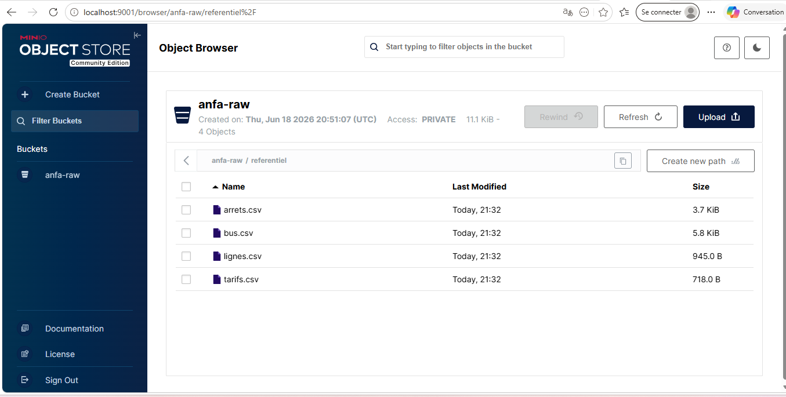

# Rendu Séance 1

**Nom et prénom :** AGBOTA Adjo Anne Bienvenue Sika

---

## Résumé de la séance

Cette séance introduit les fondamentaux du Cloud Computing à travers le projet Anfa, une plateforme data pour une société de transport urbain à Lomé.

Le Cloud Computing est défini par le NIST comme un accès réseau à la demande à des ressources informatiques partagées. Il repose sur 5 caractéristiques essentielles : le libre-service à la demande, l'accès réseau large, la mutualisation des ressources, l'élasticité rapide et le service mesuré (pay-as-you-go).

On distingue 4 modèles de service : IaaS (machines virtuelles brutes), PaaS (plateforme managée), SaaS (application prête à l'emploi) et FaaS (fonctions déclenchées par événements). Les modèles de déploiement sont : public, privé, hybride et multi-cloud.

Le cours insiste sur l'open source comme socle du cloud et sur les stratégies anti-vendor lock-in : conteneurisation, Infrastructure as Code, standards ouverts et architecture découplée.

---

## Étapes principales

1. Fork du dépôt `denisakp/cloud-bigdata-anfa-resources` sur GitHub
2. Clone du fork en local et création de la branche `seance-01`
3. Téléchargement de l'image Docker MinIO (`docker pull minio/minio`)
4. Lancement du conteneur MinIO avec les ports 9000 et 9001
5. Configuration de MinIO via `mc` dans le conteneur :
   - Création de l'alias `local`
   - Création du bucket `anfa-raw`
   - Génération de la paire de clés applicatives `anfa-app-key`
6. Création de l'environnement virtuel Python et installation de `boto3`
7. Écriture et exécution du script `upload_referentiel.py`
8. Vérification visuelle des 4 CSV dans la console MinIO (http://localhost:9001)

---

## Capture d'écran



---

## Difficultés rencontrées

- **Docker Desktop non démarré** : la première commande `docker pull` a échoué avec une erreur `cannot find the file specified`. Solution : démarrer Docker Desktop manuellement avant toute commande Docker.

- **Problème DNS avec le hotspot mobile** : Docker ne pouvait pas résoudre `auth.docker.io`. Solution : configurer les DNS Google (8.8.8.8 et 1.1.1.1) dans les paramètres réseau Windows et dans Docker Engine.

- **Erreur d'accès pip** : `pip install` refusait de s'exécuter directement. Solution : utiliser `python -m pip install` à la place.

---

## Exercices d'application

### Exercice 1 : QCM conceptuel

**1.1 — Réponse : D. Open source obligatoire**

Le NIST définit 5 caractéristiques du cloud : libre-service à la demande, accès réseau large, mutualisation des ressources, élasticité rapide et service mesuré. L'open source n'en fait pas partie — c'est un choix architectural, pas une caractéristique définitoire du cloud.

**1.2 — Réponse : C. SaaS**

Gmail est une application complète accessible via un navigateur, sans aucune installation ni gestion de serveur de la part de l'utilisateur. C'est la définition exacte du Software as a Service.

**1.3 — Réponse : D. FaaS**

Le besoin est de déclencher une fonction courte (vérification de cohérence GPS) sur un événement, sans serveur dédié tournant en permanence. C'est exactement le modèle FaaS : la fonction s'exécute en quelques millisecondes et ne coûte rien quand elle ne tourne pas.

**1.4 — Réponse : C. Cloud hybride**

La banque a deux besoins contradictoires : protéger des données sensibles soumises à des contraintes réglementaires (cloud privé) et bénéficier de l'élasticité pour les analyses (cloud public). Le cloud hybride permet de combiner les deux.

**1.5 — Réponse : B**

Le vendor lock-in est la situation où une entreprise est techniquement ou économiquement incapable de changer de fournisseur cloud sans coûts ou risques majeurs, notamment à cause d'API propriétaires, de formats fermés ou de frais de sortie élevés.

**1.6 — Réponse : C. Un service open source est forcément moins performant**

Cette affirmation est fausse. Les services managés des grands clouds (AWS EMR, Google Dataproc) sont eux-mêmes construits sur des briques open source (Apache Spark, Apache Kafka). La performance dépend de l'implémentation, pas du caractère open source ou propriétaire.

---

### Exercice 2 : Classification de services

| Service | Modèle | Justification |
|---|---|---|
| Google Compute Engine | IaaS | Fournit des machines virtuelles brutes ; l'utilisateur gère l'OS, le runtime et les applications |
| AWS Lambda | FaaS | Exécute des fonctions déclenchées par des événements, facturées à la milliseconde, sans serveur visible |
| Snowflake | SaaS | Entrepôt de données entièrement managé, accessible via navigateur, sans gestion d'infrastructure |
| Heroku | PaaS | Plateforme qui gère le runtime et le scaling ; l'utilisateur déploie uniquement son code applicatif |
| Microsoft 365 | SaaS | Applications complètes accessibles via navigateur, sans installation ni gestion serveur |
| Databricks | PaaS | Spark managé : l'utilisateur écrit ses jobs, Databricks gère les clusters et la scalabilité |
| Azure Functions | FaaS | Fonctions déclenchées par événements, facturées à l'exécution, sans serveur dédié |
| Tableau Online | SaaS | Outil de visualisation entièrement hébergé, accessible via URL sans installation |

---

### Exercice 3 : Lecture et interprétation

**3.1 — Commande docker run**
- `-d` : lance le conteneur en arrière-plan (mode détaché), sans bloquer le terminal
- `--name analyse-anfa` : donne le nom `analyse-anfa` au conteneur pour le retrouver facilement
- `-p 8888:8888` : redirige le port 8888 de la machine hôte vers le port 8888 du conteneur (accès à Jupyter via http://localhost:8888)
- `-v /home/koffi/notebooks:/notebooks` : monte le dossier local `/home/koffi/notebooks` dans le conteneur au chemin `/notebooks`, permettant de persister les notebooks sur la machine hôte
- `-e JUPYTER_TOKEN=anfa-token` : définit la variable d'environnement `JUPYTER_TOKEN` pour sécuriser l'accès à Jupyter avec le token `anfa-token`
- `jupyter/pyspark-notebook` : l'image Docker utilisée, qui contient Jupyter et PySpark préconfigurés

**Ce que fait la commande entière :** elle lance un serveur Jupyter avec PySpark en arrière-plan, accessible sur http://localhost:8888 avec le token `anfa-token`, en partageant les notebooks du dossier local de Koffi pour qu'ils soient persistants même si le conteneur est supprimé.

---

**3.2 — Lecture du docker-compose.yml**

**a. URLs d'accès depuis le navigateur :**

- `http://localhost:9000` : API S3 de MinIO (utilisée par les programmes Python/boto3)
- `http://localhost:9001` : Console web d'administration MinIO

**b. Que se passe-t-il si on supprime le conteneur puis on relance ?**

Les données ne sont **pas perdues**. Le volume nommé `minio-data` est déclaré séparément du conteneur. Quand on supprime le conteneur avec `docker rm`, seul le conteneur est supprimé, pas le volume. Au `docker compose up -d`, un nouveau conteneur est créé et se reconnecte au même volume qui contient toujours les données.

**c. Problème de sécurité en production :**

Les identifiants `MINIO_ROOT_USER` et `MINIO_ROOT_PASSWORD` sont écrits en clair dans le fichier `docker-compose.yml`. Si ce fichier est versionné sur GitHub, les credentials sont exposés publiquement. En production, il faudrait utiliser un gestionnaire de secrets (Docker Secrets, HashiCorp Vault) et ne jamais commiter de mots de passe dans le code.

---

### Exercice 4 : Diagnostic

**a. Cause précise de l'erreur :**

Le script utilise `aws_access_key_id="anfa-admin"` et `aws_secret_access_key="anfa-password-2026"`, qui sont les identifiants **root** de MinIO. Or l'étudiant a créé une clé applicative distincte via `mc` : `anfa-app-key` / `anfa-app-secret-2026`. MinIO ne reconnaît pas les identifiants root comme clés d'accès S3 — seules les clés applicatives (service accounts) sont valides pour l'API S3.

**b. Correction du code :**

```python
s3 = boto3.client(
    "s3",
    endpoint_url="http://localhost:9000",
    aws_access_key_id="anfa-app-key",
    aws_secret_access_key="anfa-app-secret-2026",
    region_name="us-east-1",
)
```

**c. Pourquoi les identifiants root fonctionnent sur la console web mais pas en S3 ?**

La console web (port 9001) utilise un mécanisme d'authentification propre à MinIO pour l'interface d'administration. L'API S3 (port 9000) requiert des clés d'accès créées explicitement via `mc admin user svcacct add`. Les credentials root ne sont pas exposés comme clés S3 valides — c'est une mesure de sécurité fondamentale.

---

### Exercice 5 : Mini-cas d'architecture

**a. Deux limites de l'architecture actuelle :**

1. **Pas de temps réel** : l'export CSV est mensuel, ce qui est incompatible avec le besoin de prédictions toutes les heures. Le pipeline dépend d'une action manuelle de Toyi sur son PC.

2. **Single Point of Failure** : toute la capacité de calcul repose sur l'ordinateur portable d'une seule personne. Si le PC est éteint ou tombe en panne, plus rien ne fonctionne. De plus, un laptop ne peut pas scaler lors des pics de demande.

**b. Caractéristiques cloud répondant aux besoins :**

| Besoin | Caractéristique NIST | Explication |
|---|---|---|
| Prédictions en quasi temps réel | Élasticité rapide | Les ressources se provisionnent automatiquement toutes les heures pour lancer le job de prédiction |
| Dashboard partagé sans installation | Accès réseau large | Tout analyste accède au dashboard via une URL depuis n'importe quel terminal |
| Augmenter la capacité lors des pics | Élasticité rapide | Le cloud scale horizontalement lors des vendredis soir et fêtes, puis redescend automatiquement |
| Maîtriser les coûts | Service mesuré (pay-as-you-go) | On ne paie que les ressources réellement consommées, sans sur-provisionner |
| Données clients dans un environnement contrôlé | Mutualisation des ressources | Un cloud privé garantit l'isolation totale des données clients |

**c. Modèles de service pour chaque composant :**

- **(i) Tableau de bord partagé → SaaS** : un outil comme Metabase ou Tableau Online est accessible via navigateur par tous les analystes sans installation. Le fournisseur gère tout.

- **(ii) Calcul des prédictions à l'heure → FaaS ou PaaS** : FaaS (ex: AWS Lambda) si le calcul est court et déclenché par un scheduler horaire ; PaaS (ex: Databricks) si les modèles sont complexes et nécessitent Spark.

- **(iii) Stockage des données clients → IaaS (cloud privé)** : pour respecter la contrainte de conformité, les données clients restent dans un environnement contrôlé, par exemple MinIO on-premise ou une VM dédiée dans une région souveraine.

**d. Modèle de déploiement recommandé : Cloud hybride**

La contrainte de conformité impose de garder les données clients dans un environnement contrôlé (cloud privé), tandis que le besoin d'élasticité pour les calculs et l'accès au dashboard plaide pour le cloud public. Le cloud hybride combine les deux : données sensibles dans le privé, traitements analytiques et dashboard dans le public, avec une connexion sécurisée entre les deux environnements.

**e. Trois stratégies contre le vendor lock-in :**

1. **Conteneuriser avec Docker** : packager les modèles ML et les jobs de prédiction dans des conteneurs qui tournent identiquement sur AWS, GCP ou Azure.

2. **Utiliser des standards ouverts** : choisir MinIO (compatible S3) pour le stockage et Apache Airflow pour l'orchestration plutôt que des services propriétaires.

3. **Décrire l'infrastructure en code avec Terraform** : l'infrastructure est décrite indépendamment du fournisseur, ce qui permet de migrer en modifiant quelques lignes de configuration.