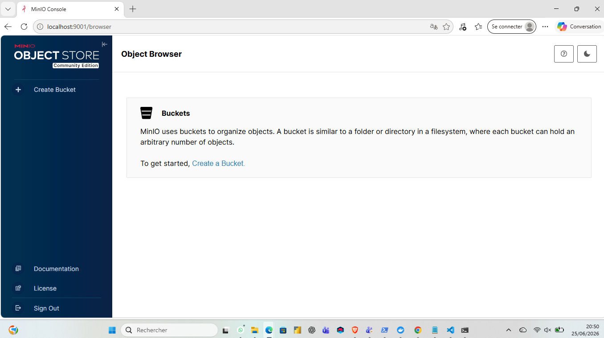
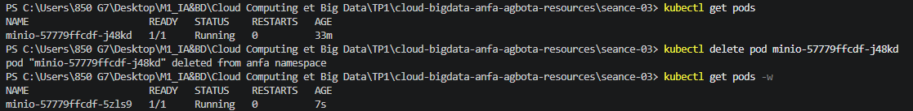
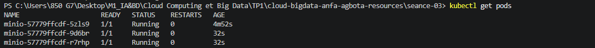

\# Rendu Séance 3

Nom et prénom : AGBOTA Adjo Anne Bienvenue Sika

Identifiant GitHub : Bienvenue-code

Date de soumission : 26/06/2026


\## Résumé de la séance

Cette séance a introduit Kubernetes comme système d'orchestration de conteneurs à travers un cluster de machines, en s'appuyant sur un container runtime (containerd, Docker ou CRI-O) plutôt qu'en le remplaçant. L'architecture d'un cluster repose sur un Control Plane, composé de plusieurs éléments : 
1. l'API Server, 
2. point d'entrée unique auquel tous les outils (dont kubectl) s'adressent ; 
3. etcd, 
4. la base de données clé-valeur qui stocke l'état complet du cluster ; 
5. le Scheduler, qui décide sur quel nœud placer un nouveau pod ; et 
6. le Controller Manager, qui fait converger l'état observé vers l'état souhaité. 

Un point essentiel du cours est que ces composants du Control Plane sont eux-mêmes des pods Kubernetes tournant dans le namespace système `kube-system` — Kubernetes se gère lui-même.

Le cours a présenté les objets fondamentaux de Kubernetes : le Pod (la plus petite unité déployable, un ou plusieurs conteneurs partageant réseau et stockage), le Deployment (qui décrit l'état souhaité d'un ensemble de pods identiques et les fait correspondre automatiquement à cet état: c'est le mécanisme de self-healing), le Service (une adresse réseau stable pointant vers un ensemble de pods via un sélecteur de labels, avec plusieurs types : ClusterIP pour un accès interne uniquement, NodePort pour exposer un port sur chaque nœud, LoadBalancer pour provisionner une IP publique chez un fournisseur cloud), le PersistentVolumeClaim (une demande de stockage persistant indépendante du cycle de vie des pods), et le Namespace (un mécanisme d'isolation logique des ressources, par équipe, environnement ou application).

Le cours a aussi évoqué des objets non détaillés en profondeur mais à connaître par leur rôle : 
1. le Job, qui exécute une tâche ponctuelle jusqu'à completion, 
2. le CronJob, qui planifie l'exécution récurrente d'un Job selon une syntaxe cron, et 
3. le StatefulSet, destiné aux applications avec état persistant nécessitant une identité réseau stable (bases de données). 

L'Horizontal Pod Autoscaler (HPA) a été présenté comme le mécanisme permettant d'ajuster automatiquement le nombre de replicas d'un Deployment en fonction d'une métrique cible (typiquement l'utilisation CPU), entre un minimum et un maximum de replicas.

Le TP a permis de manipuler concrètement Kind (Kubernetes IN Docker), un outil qui fait tourner un cluster Kubernetes complet à l'intérieur de conteneurs Docker sur la machine locale, chaque "nœud" du cluster étant en réalité un simple conteneur Docker. 
kubectl a été présenté comme l'unique interface de pilotage du cluster, communiquant exclusivement avec l'API Server. La commande `kubectl explain` a été introduite comme documentation intégrée de chaque champ d'un manifeste YAML.

\## Étapes principales

1. Installation de Kind (v0.32.0) via winget et vérification de kubectl (déjà présent, v1.34.1).
2. Création du cluster `anfa` avec l'image `kindest/node:v1.35.1`, et observation que le nœud `anfa-control-plane` est un conteneur Docker (`docker ps`).
3. Exploration initiale du cluster : tous les composants du Control Plane comme pods dans `kube-system`, et prise en main de `kubectl explain`.
4. Création du namespace `anfa` et configuration de kubectl pour l'utiliser par défaut.
5. Déploiement de MinIO via 3 manifestes YAML appliqués dans l'ordre : PersistentVolumeClaim (`minio-pvc.yaml`), Deployment (`minio-deployment.yaml`), Service de type NodePort (`minio-service.yaml`).
6. Accès à la console MinIO depuis le navigateur via `kubectl port-forward` sur les ports 9000 et 9001.
7. Observation du self-healing : suppression manuelle du pod MinIO, recréation automatique par le Deployment en quelques secondes.
8. Scaling du Deployment MinIO de 1 à 3 replicas, puis retour à 1.
9. Activation de l'Ingress Controller nginx pour Kind.


\## Résultats observés

Le PersistentVolumeClaim `minio-pvc` est resté en statut `Pending` jusqu'à la création effective du pod MinIO, avant de passer à `Bound` (2Gi, RWO, StorageClass `standard`) une fois le pod programmé — comportement dû au mode de liaison `WaitForFirstConsumer` du provisioner local de Kind, qui attend qu'un pod consomme réellement le volume avant de le lier à un nœud précis.

Le Deployment `minio` a atteint l'état `1/1 READY` et le pod est passé par les phases `ContainerCreating → Running`, confirmé par les logs affichant `API: http://10.244.0.6:9000` et `WebUI: http://10.244.0.6:9001`. Le Service `minio` de type NodePort a exposé les ports 9000 (API) et 9001 (console) sur les ports de nœud 30900 et 30901 respectivement ; l'accès effectif depuis le navigateur a nécessité un `kubectl port-forward`, le NodePort de Kind n'étant pas directement joignable depuis l'hôte.

La suppression manuelle du pod MinIO a déclenché sa recréation automatique par le Deployment en 7 secondes, avec un nouveau nom de pod (suffixe différent), confirmant que le Deployment fait converger en permanence l'état observé vers l'état souhaité (self-healing), sans aucune intervention manuelle de remise en route.

Le scaling à 3 replicas a abouti à 3 pods `Running` et un Deployment `3/3 READY` ; le retour à 1 replica a entraîné la terminaison automatique des deux pods excédentaires. L'Ingress Controller nginx s'est déployé avec succès dans le namespace `ingress-nginx`, le pod `ingress-nginx-controller` atteignant l'état `Ready` dès la première vérification.

\## Captures d'écran

\### Console MinIO accessible via port-forward



\### Self-healing observé



\### Scaling à 3 replicas



\## Réponses aux exercices d'application

\### Exercice 1 — QCM conceptuel

Kubernetes orchestre des conteneurs sur un cluster de machines en s'appuyant sur un container runtime existant (containerd, Docker, CRI-O) ; il ne fournit pas son propre moteur de conteneurs et ne remplace donc pas Docker, il le pilote à grande échelle.

Le composant qui stocke l'état complet du cluster est etcd, une base de données clé-valeur distribuée ; l'API Server, lui, expose cet état et le modifie, mais ne le stocke pas directement.

Le composant qui décide sur quel nœud placer un nouveau pod est le Scheduler, qui évalue les ressources disponibles et les contraintes de placement avant d'assigner un pod à un nœud.

Lorsqu'on tape `kubectl get pods`, kubectl s'adresse exclusivement à l'API Server, point d'entrée unique du cluster ; c'est l'API Server qui interroge ensuite etcd pour répondre à la requête.

Supprimer un pod géré par un Deployment avec `kubectl delete pod` ne le supprime pas définitivement : le Deployment détecte l'écart entre l'état observé (0 pod) et l'état souhaité (le nombre de replicas défini) et recrée immédiatement un nouveau pod pour combler cet écart : c'est exactement le comportement de self-healing observé en pratique dans ce TP.

Le type de Service qui permet d'accéder à un Deployment depuis l'extérieur du cluster sans passer par un load balancer cloud est NodePort, qui ouvre un port fixe (entre 30000 et 32767) sur chaque nœud du cluster.

La commande `kubectl scale deployment minio --replicas=5` ne modifie pas la taille du cluster ni ne crée de nouveaux Deployments : elle change l'état souhaité du Deployment existant à 5 replicas, et Kubernetes fait converger le nombre de pods actifs vers ce chiffre, qu'il s'agisse d'en créer ou d'en supprimer par rapport à l'état actuel.

Un Namespace sert à isoler logiquement des ressources au sein d'un même cluster, typiquement pour séparer des équipes, des environnements (développement, production) ou des applications distinctes ; il n'a pas de rôle de chiffrement ni de nommage du cluster lui-même.

Avec Kind, chaque nœud du cluster Kubernetes est en réalité un conteneur Docker, et non une machine virtuelle ni un simple processus : c'est ce qu'a confirmé la commande `docker ps`, qui a montré le conteneur `anfa-control-plane` basé sur l'image `kindest/node`.


\### Exercice 2 — Lecture et interprétation d'un manifeste

Le champ `selector.matchLabels` définit quels pods sont gérés par le Deployment : il doit correspondre exactement aux labels définis dans `template.metadata.labels`, qui sont les labels apposés sur les pods créés par ce Deployment. C'est ce lien qui permet au Deployment de savoir quels pods lui appartiennent, de les compter, de les recréer en cas de défaillance, ou de les cibler pour un scaling.

Ce Deployment crée 2 pods, puisque `replicas: 2`. Si l'un des deux meurt, le Deployment détecte l'écart entre l'état observé (1 pod restant) et l'état souhaité (2 replicas) et recrée automatiquement un nouveau pod pour revenir à 2.

L'endpoint `http://minio:9000` fonctionne grâce à la résolution DNS interne fournie par Kubernetes (CoreDNS) : chaque Service reçoit automatiquement un nom DNS correspondant à son nom (`minio`), résolvable depuis n'importe quel pod du même namespace (ou via un nom complet depuis un autre namespace). Une adresse IP serait instable, car les pods peuvent être recréés avec de nouvelles IP à tout moment ; le nom de Service, lui, reste stable tant que le Service existe.

L'absence de Service dans ce manifeste signifie que les pods de `anfa-api` n'ont aucune adresse réseau stable et ne sont pas accessibles de façon fiable, ni depuis l'intérieur du cluster, ni depuis l'extérieur. On pourrait toujours atteindre un pod individuellement par son IP interne, mais cette IP change à chaque recréation du pod, rendant cette approche inutilisable en pratique.

Un manifeste de Service exposant ce Deployment à l'intérieur du cluster, sur le port 80 redirigé vers le port 8000 du conteneur, s'écrirait ainsi :

```yaml
apiVersion: v1
kind: Service
metadata:
&#x20; name: anfa-api
&#x20; namespace: anfa
spec:
&#x20; type: ClusterIP
&#x20; selector:
&#x20;   app: anfa-api
&#x20; ports:
&#x20;   - port: 80
&#x20;     targetPort: 8000
```


\### Exercice 3 — Diagnostic

\*\*Le pod qui ne démarre pas.\*\* Le statut `ImagePullBackOff` signifie que Kubernetes a tenté de télécharger l'image du conteneur depuis un registre, que cette tentative a échoué, et que kubelet attend désormais un délai croissant avant de réessayer (backoff exponentiel), plutôt que de réessayer en boucle immédiatement. La cause la plus probable ici est la faute de frappe dans le nom de l'image (`minio/miniooo:latest` au lieu de `minio/minio:latest`), qui pointe vers une image inexistante sur le registre. La commande `kubectl describe pod <nom>` permet d'obtenir le détail de l'erreur, en particulier dans la section Events, où apparaît typiquement un message explicite du type « repository does not exist or may require authorization » ou « manifest unknown ».

\*\*Le PVC qui ne se lie pas.\*\* Un PVC en statut `Pending` signifie que Kubernetes n'a pas encore réussi à associer ce PVC à un volume de stockage correspondant à la demande. Dans un cluster Kind local, la cause la plus probable, au-delà d'une éventuelle absence de StorageClass, est que le StorageClass utilisé (`standard`, fourni par le provisioner local-path de Kind) fonctionne en mode `WaitForFirstConsumer` : le volume n'est provisionné qu'au moment où un pod consomme réellement le PVC, donc tant qu'aucun pod ne référence ce PVC dans son `spec.volumes`, il reste `Pending` — ce qui correspond exactement à ce qui a été observé en pratique dans ce TP avant le déploiement du pod MinIO. Si malgré la création d'un pod consommateur le PVC restait bloqué, la commande `kubectl describe pvc <nom>` permettrait de confirmer la cause exacte via la section Events.

\*\*Le port-forward qui échoue.\*\* Cette erreur apparaît parce que `kubectl port-forward` a besoin d'un pod en cours d'exécution (`Running`) pour établir la redirection de port ; si le pod ciblé par le Service est encore en `Pending`, il n'existe aucun processus vers lequel rediriger le trafic. La commande `kubectl describe pod <nom-du-pod>` permet de comprendre pourquoi le pod reste en `Pending` (ressources insuffisantes, image en cours de téléchargement, contrainte de scheduling non satisfaite, etc.), complétée si besoin par `kubectl get events` pour une vue chronologique. L'ordre logique à respecter est donc : vérifier que le Deployment et ses pods sont bien `Running` (`kubectl get pods`), s'assurer que le Service cible correctement ces pods, puis seulement à ce moment lancer le `port-forward`.


\### Exercice 4 — De Docker Compose à Kubernetes

Reproduire ce service Compose unique nécessite trois manifestes Kubernetes distincts : un PersistentVolumeClaim, qui remplace le volume nommé `minio-data` et formalise la demande de stockage persistant ; un Deployment, qui décrit le pod MinIO, son image, ses variables d'environnement, ses ports et le montage du volume, et qui assure son maintien en vie ; et un Service, qui fournit une adresse réseau stable vers le pod et gère l'exposition des ports (NodePort dans le cas observé en TP).

Un volume Docker nommé est une simple zone de stockage géré par le moteur Docker sur la machine hôte, créée implicitement et liée directement au conteneur qui la déclare, sans notion de cycle de vie séparé ni de classe de stockage. Un PersistentVolumeClaim, en revanche, est une demande abstraite de stockage exprimée par l'application, qui est ensuite satisfaite par un PersistentVolume provisionné dynamiquement ou statiquement selon une StorageClass ; cette séparation permet au volume de stockage et au pod qui l'utilise d'avoir des cycles de vie indépendants, et permet au cluster d'orchestrer des volumes répartis sur différents nœuds ou backends de stockage (disque local, NFS, stockage cloud), ce qu'un simple volume Docker nommé ne permet pas.

La différence d'accès observée vient du fait que Kind exécute le cluster Kubernetes entièrement à l'intérieur de conteneurs Docker isolés du réseau de l'hôte : un NodePort expose bien le port sur le nœud (le conteneur Kind), mais ce port n'est pas automatiquement republié sur la machine hôte, contrairement à Docker Compose où le mapping de ports (`ports: - "9001:9001"`) est géré directement par le moteur Docker sur l'hôte. Pour obtenir un accès direct équivalent à celui de Compose, il faudrait soit configurer Kind dès sa création avec un fichier de configuration `extraPortMappings` qui republie explicitement les ports du conteneur Kind vers l'hôte, soit utiliser un Service de type `LoadBalancer` couplé à un outil comme `cloud-provider-kind`, soit, en environnement de production sur un vrai cluster cloud, utiliser un Service `LoadBalancer` qui provisionnerait une IP publique directement.

Deux apports concrets de Kubernetes par rapport à Docker Compose, observés en TP, sont d'une part le self-healing automatique (la suppression manuelle d'un pod a entraîné sa recréation immédiate et autonome par le Deployment, sans qu'aucune commande de relance ne soit nécessaire, contrairement à Compose où un conteneur arrêté reste arrêté tant qu'on ne le relance pas explicitement, sauf politique de redémarrage explicite), et d'autre part le scaling déclaratif instantané (`kubectl scale deployment minio --replicas=3` a fait passer le nombre de pods de 1 à 3 puis de 3 à 1 en une seule commande, Kubernetes gérant lui-même la création et la suppression des pods nécessaires, alors que Compose ne propose pas nativement cette notion de convergence vers un nombre de replicas cible avec surveillance continue).


\### Exercice 5 — Mini-cas d'architecture

Pour le pipeline batch `pipeline-anfa`, qui s'exécute une fois par nuit pendant une durée bornée d'environ 15 minutes puis se termine, l'objet le plus adapté est un CronJob : il permet de planifier une exécution récurrente selon une syntaxe cron (ici, une fois par jour à 2h du matin), et chaque exécution se comporte comme un Job ponctuel qui se termine une fois la tâche achevée, sans qu'aucun pod ne tourne en continu inutilement entre deux exécutions.

Pour l'API REST `anfa-api`, qui doit rester disponible en permanence et absorber une charge variable, l'objet adapté est un Deployment : il maintient un ensemble de pods sans état persistant individuel, identiques et interchangeables, ce qui correspond exactement au profil d'une API REST sans état, et se combine naturellement avec un Horizontal Pod Autoscaler pour s'adapter à la charge.

Pour le dashboard Grafana `anfa-dashboard`, consulté en journée par un nombre restreint de personnes avec une exigence de disponibilité standard (non critique), un Deployment avec un nombre de replicas modeste (1 ou 2) est également l'objet adapté : il ne s'agit pas d'une tâche ponctuelle (donc pas de Job ou CronJob), et il n'y a pas de besoin d'identité réseau stable individuelle ni de stockage propre à chaque instance (donc pas de StatefulSet), Grafana étant ici un simple consommateur d'API sans état critique à préserver entre les pods.

Pour le Horizontal Pod Autoscaler de `anfa-api`, au vu du profil de charge décrit (environ 5 requêtes/seconde en creux, jusqu'à 50 requêtes/seconde aux heures de pointe, soit un facteur 10 entre les deux), des paramètres raisonnables seraient un `minReplicas` de 2 (pour garantir une redondance minimale même hors pointe, évitant un point de défaillance unique) et un `maxReplicas` autour de 10 à 15 (pour absorber largement le pic sans sur-dimensionner inutilement le cluster), avec une métrique cible basée sur l'utilisation CPU moyenne des pods, par exemple un seuil de 60 à 70 % : ce seuil laisse une marge de réaction avant saturation, le temps que de nouveaux pods soient créés et deviennent prêts à absorber le trafic supplémentaire.

Pour `anfa-api`, le type de Service le plus adapté est ClusterIP, qui suffit pour une exposition interne au cluster ; l'exposition réelle vers les applications mobiles des conducteurs (donc depuis l'extérieur du cluster) serait alors assurée par un Ingress placé devant ce Service ClusterIP, plutôt que par un Service de type NodePort ou LoadBalancer exposé directement, ce qui permet de centraliser la gestion du trafic entrant (routage par chemin ou nom d'hôte, certificats TLS) au niveau de l'Ingress Controller plutôt qu'au niveau de chaque Service individuel.

Par défaut, Kubernetes gère les mises à jour d'un Deployment via une stratégie de déploiement progressif appelée RollingUpdate : plutôt que d'arrêter tous les anciens pods puis de démarrer tous les nouveaux, Kubernetes démarre progressivement de nouveaux pods avec la nouvelle version de l'image, attend qu'ils deviennent prêts (passent les sondes de disponibilité), puis ne retire les anciens pods qu'au fur et à mesure que les nouveaux sont opérationnels, en respectant des paramètres de marge (`maxSurge`, nombre de pods supplémentaires temporairement tolérés, et `maxUnavailable`, nombre de pods pouvant être indisponibles simultanément pendant la mise à jour). Ce mécanisme garantit qu'à tout moment de la mise à jour, un nombre suffisant de pods reste disponible pour servir le trafic, évitant ainsi une coupure de service complète.

Un squelette de manifeste Deployment pour `anfa-api` pourrait s'écrire ainsi :

```yaml
apiVersion: apps/v1
kind: Deployment
metadata:
&#x20; name: anfa-api
&#x20; namespace: anfa
spec:
&#x20; replicas: 3
&#x20; selector:
&#x20;   matchLabels:
&#x20;     app: anfa-api
&#x20; template:
&#x20;   metadata:
&#x20;     labels:
&#x20;       app: anfa-api
&#x20;   spec:
&#x20;     containers:
&#x20;       - name: api
&#x20;         image: anfa/api:v1
&#x20;         ports:
&#x20;           - containerPort: 8000
&#x20;         env:
&#x20;           - name: MINIO\_ENDPOINT
&#x20;             value: "http://minio:9000"
```


\## Difficultés rencontrées

Le pod MinIO est resté bloqué en `ImagePullBackOff` lors de la première tentative de déploiement, le nœud `anfa-control-plane` ne parvenant pas à résoudre `registry-1.docker.io` (erreur DNS, `i/o timeout`) : le diagnostic via `kubectl describe pod` a révélé une erreur réseau plutôt qu'une faute de frappe. La cause s'est révélée être une instabilité du réseau utilisé (partage de connexion mobile) ; le passage à un réseau Wi-Fi domestique a résolu le problème sans intervention supplémentaire, le pod passant alors normalement en `Running`. Le PersistentVolumeClaim `minio-pvc` est resté en statut `Pending` plus longtemps qu'annoncé dans l'énoncé du TP avant de passer en `Bound` ; ce comportement, lié au mode `WaitForFirstConsumer` du StorageClass de Kind, est normal et non bloquant, le PVC ne se liant qu'au moment où le pod consommateur est effectivement programmé.
