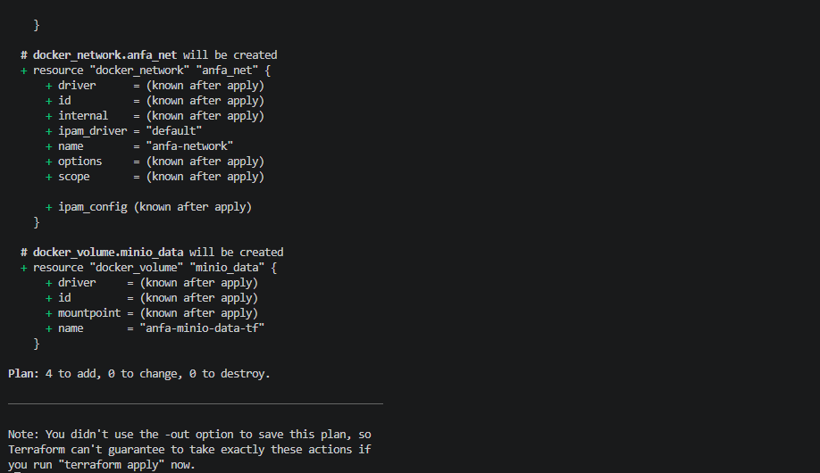
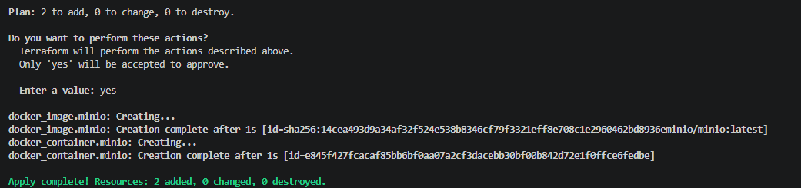
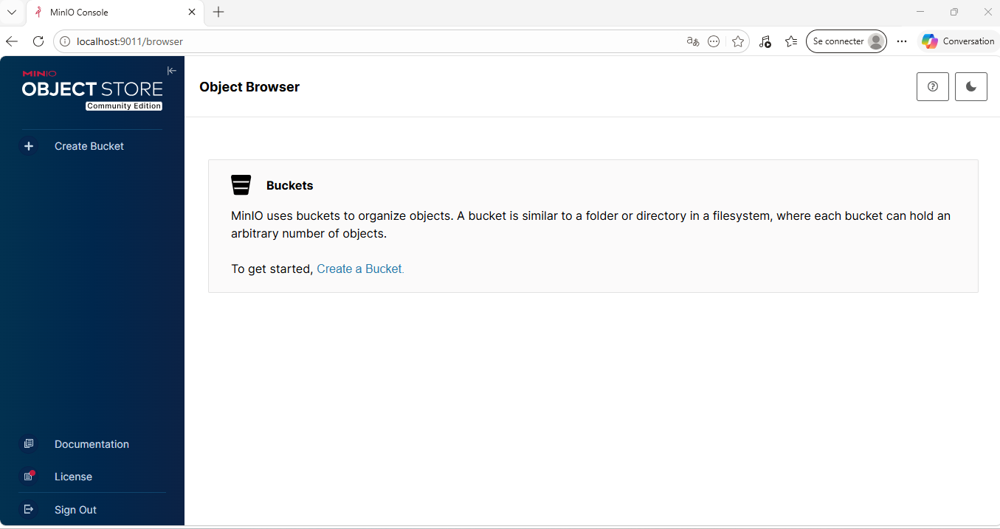
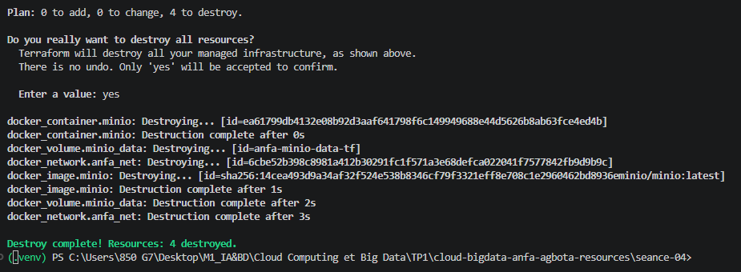

# Rendu — Séance 4 : Infrastructure as Code avec Terraform

**Nom et prénom :** AGBOTA Adjo Anne Bienvenue Sika  
**Identifiant GitHub :** Bienvenue-code  
**Date de soumission :** 27/06/2026

---

## Résumé de la séance

Cette séance a introduit **Terraform** comme outil d'Infrastructure as Code (IaC). Nous avons décrit en HCL (HashiCorp Configuration Language) une infrastructure Docker complète pour le projet Anfa : réseau, volume, image et conteneur MinIO. Le workflow fondamental `init → plan → apply → destroy` a été maîtrisé, le rôle du fichier `terraform.tfstate` compris (et sa sensibilité), et le code refactorisé via des variables pour le rendre propre et réutilisable.

Voici globalement les points clés abordés :
1. **Infrastructure as Code (IaC) :** Pratique consistant à définir, provisionner et gérer l'infrastructure (réseaux, conteneurs, machines virtuelles, volumes) à l'aide de fichiers de configuration textuels et versionnés. Cela garantit la répétabilité, évite les erreurs humaines dues aux configurations manuelles et permet le suivi via Git.
2. **Approche Déclarative vs Impérative :** Terraform utilise une approche *déclarative* (via le langage HCL). On décrit l'état final souhaité (ex: "*Je veux un conteneur MinIO ouvert sur tel port*"), et Terraform se charge de déterminer la séquence d'actions pour atteindre cet état. À l'inverse, l'approche *impérative* (scripts Bash, Docker CLI) liste les étapes d'exécution exactes.
3. **Idempotence :** Propriété d'une opération qui produit le même résultat, quel que soit le nombre de fois où elle est exécutée. Si l'infrastructure réelle correspond déjà à la configuration cible, Terraform ne fait rien.
4. **Le Cycle de Vie Terraform (Workflow) :**
   * `terraform init` : Initialise le répertoire de travail et télécharge les plugins des fournisseurs (*providers*).
   * `terraform plan` : Génère et affiche un plan d'exécution détaillant les changements à venir (ajouts `+`, modifications `~`, destructions `-`).
   * `terraform apply` : Exécute les actions requises pour atteindre l'état décrit.
   * `terraform destroy` : Supprime l'intégralité des ressources gérées par la configuration.
5. **Le fichier d'État (`terraform.tfstate`) :** Fichier JSON local servant de source de vérité à Terraform pour mapper le code HCL aux ressources réelles. Ce fichier contient des informations sensibles (comme des mots de passe en clair) et **ne doit jamais être poussé sur Git**.
---

## Points clés du cours (Détails)

### 1. Infrastructure as Code (IaC)

L'IaC consiste à décrire l'infrastructure dans des **fichiers texte versionnés** (comme du code source). Les bénéfices sont la reproductibilité, la traçabilité via Git (code review, historique), et la possibilité d'appliquer la même définition partout de façon identique. L'IaC ne supprime pas la nécessité de comprendre l'infrastructure sous-jacente — elle la documente et l'automatise.

### 2. Approche déclarative vs impérative

- **Déclarative (Terraform)** : on décrit l'**état souhaité** (« je veux un conteneur MinIO avec ces ports »). Terraform calcule lui-même les actions nécessaires.
- **Impérative (scripts bash, Ansible en mode ad-hoc)** : on décrit la **séquence d'actions** à effectuer (« fais `docker run`, puis `docker network connect`… »).

### 3. Le workflow Terraform

| Commande | Rôle |
|---|---|
| `terraform init` | Initialise le dossier, télécharge les providers |
| `terraform plan` | Prévisualise les changements sans rien modifier |
| `terraform apply` | Applique les changements (avec confirmation `yes`) |
| `terraform destroy` | Supprime toute l'infrastructure gérée |

### 4. Idempotence

Lancer `terraform apply` deux fois sans modifier le code produit le même résultat : `No changes. Your infrastructure matches the configuration.` Terraform compare en permanence le **state** (ce qui existe) au **code** (ce qui est demandé).

### 5. Le fichier `terraform.tfstate`

C'est la mémoire de Terraform : il contient l'état complet de l'infrastructure (IDs des ressources, configurations, et **secrets en clair**). Trois règles fondamentales :

1. **Ne jamais le committer dans Git** → il contient des mots de passe, clés API, etc.
2. **Ne jamais le modifier à la main** → Terraform s'attend à le retrouver exact.
3. **En équipe, utiliser un remote backend** (S3, Terraform Cloud…) pour le partager en sécurité.

### 6. Providers et ressources

Un **provider** est un plugin qui sait communiquer avec une API spécifique (Docker, AWS, Kubernetes…). Chaque **resource** correspond à un objet géré : réseau, volume, image, conteneur. Terraform calcule automatiquement l'ordre de création à partir des références entre ressources (dépendances implicites).

### 7. Variables et bonnes pratiques

- `variables.tf` : définit les variables avec leurs types et valeurs par défaut.
- `terraform.tfvars` : fournit les valeurs sensibles — **exclu de Git via `.gitignore`**.
- `terraform.tfvars.example` : modèle non sensible versionné pour les collaborateurs.

---

## Étapes principales réalisées

1. **Installation de Terraform** via Chocolatey sur Windows (`terraform v1.15.7` confirmé).
2. **Création de la branche** `seance-04` depuis `main`, dossier `seance-04/` créé.
3. **Premier `main.tf` minimal** : image + conteneur MinIO (ports 9010/9011), provider `kreuzwerker/docker`.
4. **Workflow complet** : `terraform init` → `terraform plan` → `terraform apply` → vérification console MinIO → `terraform destroy`.
5. **Exploration du state** : observation du mot de passe en clair dans `terraform.tfstate`, test de l'idempotence (`No changes`).
6. **Création du `.gitignore`** Terraform : exclusion de `.terraform/`, `*.tfstate*`, `*.tfvars`.
7. **Stack complète** : ajout du réseau `docker_network` et du volume `docker_volume` dans `main.tf`.
8. **Changement incrémental** : modification du mot de passe → Terraform recrée seulement le conteneur, préserve le volume.
9. **Refactoring en variables** : création de `variables.tf` et `terraform.tfvars`, références via `var.xxx` dans `main.tf`.
10. **Destruction propre finale** : réseau, volume et conteneur supprimés dans le bon ordre par Terraform.

---

## Captures d'écran

### terraform plan (création initiale)



### terraform apply réussi



### Console MinIO créée par Terraform



### terraform destroy



---

## Réponses aux exercices d'application

---

### Exercice 1 — QCM conceptuel

---

**Question 1.1** — Parmi ces affirmations sur l'Infrastructure as Code, laquelle est fausse ?

> **Réponse : B — « L'IaC remplace totalement la nécessité de comprendre l'infrastructure sous-jacente. »**
>
> C'est faux : l'IaC automatise et documente l'infrastructure, mais elle ne dispense pas de comprendre ce qu'on décrit. Sans connaissance des concepts réseau, stockage et conteneurs, on ne peut pas écrire un code HCL pertinent ni diagnostiquer les erreurs.

---

**Question 1.2** — Quelle est la différence fondamentale entre une approche déclarative et une approche impérative ?

> **Réponse : B — « Le déclaratif décrit l'état souhaité ; l'impératif décrit la séquence d'actions à effectuer. »**
>
> Avec Terraform (déclaratif), on dit « je veux un conteneur MinIO avec ces paramètres » ; Terraform détermine seul les étapes. Un script bash (impératif) liste explicitement chaque commande à exécuter dans l'ordre.

---

**Question 1.3** — Que signifie qu'une opération est idempotente ?

> **Réponse : B — « Elle produit le même résultat quel que soit le nombre de fois où elle est appliquée. »**
>
> Lancer `terraform apply` deux fois de suite sans modifier le code donne le même état final : `No changes`. L'idempotence est un pilier de l'IaC car elle garantit la cohérence.

---

**Question 1.4** — À quoi sert un provider dans Terraform ?

> **Réponse : B — « À fournir un plugin qui sait communiquer avec une API spécifique (AWS, Docker, Kubernetes…). »**
>
> Dans notre TP, le provider `kreuzwerker/docker` permet à Terraform de piloter Docker via son API locale. Sans provider, Terraform ne sait pas ce qu'est un `docker_container`.

---

**Question 1.5** — Que se passe-t-il si vous lancez `terraform apply` deux fois de suite sans modifier votre code ?

> **Réponse : B — « Terraform compare le state au code, ne voit aucun écart, et n'effectue aucune action. »**
>
> C'est l'idempotence en action. Terraform lit `terraform.tfstate`, compare à la configuration HCL, et conclut qu'il n'y a rien à faire. Aucune ressource n'est recréée ni modifiée.

---

**Question 1.6** — Quelle est la fonction du fichier `terraform.tfstate` ?

> **Réponse : C — « Mémoriser ce que Terraform a créé pour pouvoir suivre les changements incrémentaux. »**
>
> Sans ce fichier, Terraform ne saurait pas quelles ressources il a déjà créées, et ne pourrait pas calculer les modifications à apporter ni effectuer un `destroy` propre.

---

**Question 1.7** — Pourquoi ne faut-il jamais committer le fichier `terraform.tfstate` dans Git ?

> **Réponse : B — « Parce qu'il peut contenir des secrets en clair (mots de passe, clés API) et peut être corrompu par des commits concurrents. »**
>
> Nous l'avons constaté directement dans le TP : `MINIO_ROOT_PASSWORD=anfa-password-2026` apparaissait en clair dans le JSON du state. Committer ce fichier exposerait les secrets à tous les accès au dépôt.

---

**Question 1.8** — Quelle commande exécutez-vous avant `terraform apply` pour vérifier ce qui va changer ?

> **Réponse : C — `terraform plan`**
>
> `terraform plan` prévisualise exactement les actions que Terraform compte effectuer (créations `+`, suppressions `-`, modifications `~`) sans appliquer quoi que ce soit. C'est le réflexe fondamental avant tout apply.

---

**Question 1.9** — Que représente OpenTofu ?

> **Réponse : B — « Un fork open source de Terraform créé après le changement de licence de HashiCorp en 2023. »**
>
> En 2023, HashiCorp a changé la licence de Terraform (de MPL vers BSL), ce qui a poussé la communauté à créer OpenTofu sous la Linux Foundation, maintenu en open source et compatible avec la syntaxe HCL de Terraform.

---

**Question 1.10** — Terraform et Ansible sont-ils des outils concurrents ?

> **Réponse : B — « Non, Terraform provisionne l'infrastructure, Ansible configure des machines existantes — ils sont complémentaires. »**
>
> Terraform crée et gère les ressources (VM, réseaux, volumes, conteneurs). Ansible configure ensuite ces ressources (installe des paquets, déploie des fichiers de config). Les deux s'utilisent souvent ensemble dans un pipeline CI/CD.

---

### Exercice 2 — Lecture et interprétation d'un fichier Terraform

---

**Question 2.1** — Listez les 4 resources définies dans ce fichier, et expliquez en une ligne ce que chacune fait.

> **Réponse :**
>
> - `docker_network "back"` : crée un réseau Docker nommé `anfa-backend` pour isoler les services.
> - `docker_volume "data"` : crée un volume Docker nommé `postgres-data` pour la persistance des données.
> - `docker_image "postgres"` : télécharge l'image `postgres:15` depuis Docker Hub.
> - `docker_container "db"` : lance le conteneur PostgreSQL en utilisant l'image, le volume et le réseau définis ci-dessus.

---

**Question 2.2** — À quoi correspond `docker_image.postgres.image_id` ? Qu'apporte cette référence par rapport à écrire `image = "postgres:15"` directement ?

> **Réponse :**
>
> `docker_image.postgres.image_id` référence l'attribut `image_id` de la resource `docker_image` nommée `postgres`. Cet identifiant est le SHA256 de l'image réellement téléchargée (ex : `sha256:14cea493...`).
>
> Par rapport à `image = "postgres:15"` en dur, cette référence apporte deux avantages :
> 1. **Dépendance implicite** : Terraform sait qu'il doit créer `docker_image.postgres` *avant* `docker_container.db`, et respecte cet ordre automatiquement.
> 2. **Cohérence** : on utilise l'ID exact de l'image réellement téléchargée, évitant tout écart si le tag `postgres:15` pointe vers une image différente entre deux environnements.

---

**Question 2.3** — Si l'étudiant lance `terraform apply` pour la première fois, dans quel ordre Terraform créera-t-il les resources ? Pourquoi ?

> **Réponse :**
>
> Terraform créera les ressources dans cet ordre :
>
> 1. `docker_network.back` et `docker_volume.data` (en parallèle, aucune dépendance entre eux)
> 2. `docker_image.postgres` (indépendant aussi, peut être parallèle avec les deux précédents)
> 3. `docker_container.db` en dernier (car il référence les trois autres : `docker_image.postgres.image_id`, `docker_volume.data.name`, `docker_network.back.name`)
>
> Terraform analyse le graphe de dépendances implicites créé par les références entre ressources, et ne crée le conteneur qu'une fois ses trois dépendances disponibles.

---

**Question 2.4** — Quel est le problème principal de ce fichier sur le plan de la sécurité ? Proposez une correction concrète.

> **Réponse :**
>
> Le mot de passe PostgreSQL `secret123` est écrit **en clair dans le code** : `"POSTGRES_PASSWORD=secret123"`. Ce code étant probablement versionné dans Git, ce secret sera exposé dans l'historique du dépôt.
>
> **Correction** : extraire le secret dans une variable et le fournir via un fichier `terraform.tfvars` exclu de Git.
>
> Dans `variables.tf` :
> ```hcl
> variable "postgres_password" {
>   description = "Mot de passe PostgreSQL"
>   type        = string
>   sensitive   = true
> }
> ```
>
> Dans `main.tf`, remplacer la ligne par :
> ```hcl
> env = [
>   "POSTGRES_DB=anfa",
>   "POSTGRES_USER=anfa_user",
>   "POSTGRES_PASSWORD=${var.postgres_password}",
> ]
> ```
>
> Dans `terraform.tfvars` (exclu du `.gitignore`) :
> ```hcl
> postgres_password = "secret123"
> ```
>
> Ajouter `*.tfvars` au `.gitignore` et fournir un `terraform.tfvars.example` sans valeur réelle.

---

**Question 2.5** — L'étudiant lance `terraform destroy`, modifie `external = 5432` en `external = 5433`, puis relance `terraform apply`. Que va faire Terraform ? Justifiez.

> **Réponse :**
>
> Puisque `terraform destroy` a été lancé avant, `terraform.tfstate` est vide (aucune infrastructure existante). Terraform va donc **recréer toute l'infrastructure depuis zéro** : réseau, volume, image et conteneur, ce dernier exposant cette fois le port `5433` au lieu de `5432`.
>
> Si l'étudiant avait *uniquement* modifié le port sans faire de `destroy` préalable, Terraform aurait proposé de **recréer le conteneur** (les configurations de ports ne sont pas modifiables à chaud sur Docker), tout en conservant le réseau et le volume inchangés. Les données du volume auraient été préservées.

---

### Exercice 3 — Diagnostic

---

#### 3.1 — L'apply qui échoue avec une dépendance circulaire

**a. Que signifie cette erreur `Error: Cycle` ?**

> Terraform a détecté une **dépendance circulaire** : la ressource `docker_container.a` dépend de `docker_container.b` (elle référence `docker_container.b.name`), et en même temps `docker_container.b` dépend de `docker_container.a` (elle référence `docker_container.a.name`). Le graphe de dépendances forme un cycle sans point de départ possible.

---

**b. Pourquoi Terraform refuse-t-il d'appliquer ce code ?**

> Pour créer `container-a`, Terraform a besoin du nom de `container-b` (déjà existant). Mais pour créer `container-b`, il a besoin du nom de `container-a`. Aucun des deux ne peut être créé en premier : c'est une impasse logique. Terraform refuse d'appliquer plutôt que de tomber dans une boucle infinie.

---

**c. Comment résoudre ce problème ? Proposez une solution.**

> La solution est de **casser la dépendance circulaire** en utilisant une valeur statique ou une variable pour l'un des conteneurs plutôt qu'une référence dynamique.
>
> ```hcl
> variable "container_a_name" {
>   default = "container-a"
> }
>
> resource "docker_container" "a" {
>   name  = var.container_a_name
>   image = "alpine"
>   env   = ["LINKED_TO=container-b"]  # valeur statique
> }
>
> resource "docker_container" "b" {
>   name  = "container-b"
>   image = "alpine"
>   env   = ["LINKED_TO=${docker_container.a.name}"]  # référence unidirectionnelle
> }
> ```
>
> Avec cette correction, `b` dépend de `a` mais pas l'inverse : Terraform crée `a` d'abord, puis `b`.

---

#### 3.2 — Le plan qui veut tout recréer

**a. Pourquoi Terraform marque-t-il le conteneur avec `-/+` plutôt que `~` ?**

> Le symbole `-/+` (destroy + create) signifie que la ressource **doit être détruite puis recréée**. Docker ne permet pas de modifier les variables d'environnement d'un conteneur en cours d'exécution : elles sont figées à la création. Pour appliquer le changement, Terraform doit arrêter le conteneur, le supprimer, et en créer un nouveau avec les nouvelles valeurs. Le `~` (modification en place) n'est utilisé que pour des attributs que l'API Docker accepte de modifier à chaud (ex : le nom dans certains cas).

---

**b. Si le conteneur monte un volume, les données seront-elles perdues ?**

> **Non, les données ne seront pas perdues**, à condition que le volume soit déclaré comme une ressource `docker_volume` séparée dans Terraform (comme dans notre TP). Le volume a son propre cycle de vie indépendant du conteneur : Terraform supprime et recrée le conteneur, mais le volume `anfa-minio-data-tf` reste intact et est remonté dans le nouveau conteneur. Si les données étaient stockées dans le conteneur lui-même (sans volume), elles seraient perdues.

---

**c. Cette opération de recréation est-elle "gratuite" en production ? Quel impact opérationnel ?**

> Non, elle n'est pas gratuite en production. Les impacts potentiels sont :
>
> - **Temps d'arrêt (downtime)** : pendant la destruction et la recréation du conteneur (quelques secondes à quelques minutes), le service est indisponible.
> - **Interruption des connexions actives** : les clients connectés au moment de la destruction verront leurs requêtes échouer.
> - **Risque de perte de données en transit** : si des données n'avaient pas encore été flushées sur le volume au moment du `destroy`.
>
> En production, ce type de changement doit être planifié dans une fenêtre de maintenance, ou géré via un déploiement blue/green pour éviter l'interruption de service.

---

#### 3.3 — Le state corrompu

**a. Quel problème de sécurité immédiat est créé par ce push ?**

> Le fichier `terraform.tfstate` contient les secrets **en clair** (mots de passe, clés API, tokens). En le poussant sur GitHub, ces secrets sont exposés à toute personne ayant accès au dépôt (collaborateurs, mais aussi potentiellement le public si le dépôt est public). Même après suppression du fichier dans un commit ultérieur, les secrets restent accessibles dans l'historique Git.

---

**b. Quel risque technique se présente quand Awa applique Terraform avec ce state récupéré ?**

> Awa va appliquer Terraform avec un state qui décrit l'infrastructure de son collègue, potentiellement sur une **autre machine ou un autre environnement**. Deux scénarios problématiques :
>
> - Si Awa n'a pas les mêmes ressources Docker locales, Terraform va tenter de créer des ressources qui existent déjà ailleurs → **conflits** ou **doublons**.
> - Si le state décrit des ressources qui n'existent plus sur la machine d'Awa, Terraform va tenter de les modifier ou supprimer → **comportement imprévu**, voire destruction d'infrastructure non souhaitée.

---

**c. Quelle est la solution pérenne pour éviter ce genre de situation en équipe ?**

> La solution est d'utiliser un **remote backend** pour stocker le state de façon centralisée et sécurisée :
>
> - **Terraform Cloud / HCP Terraform** : solution officielle de HashiCorp avec gestion des accès et chiffrement.
> - **Backend S3 + DynamoDB** (AWS) : bucket S3 chiffré pour le state, DynamoDB pour le verrouillage concurrent.
> - **Backend GCS** (Google Cloud Storage) ou **Azure Blob Storage**.
>
> Avec un remote backend, le state n'est plus jamais sur les machines locales, les secrets ne transitent pas par Git, et le verrouillage empêche deux personnes d'appliquer Terraform simultanément (évitant la corruption).

---

### Exercice 4 — Adaptation Compose → Terraform

---

**Question** — Traduisez le `docker-compose.yml` de la séance 2 en code Terraform équivalent.

> **Réponse :**
>
> ```hcl
> # variables.tf
> variable "minio_root_password" {
>   description = "Mot de passe root MinIO"
>   type        = string
>   sensitive   = true
> }
>
> variable "jupyter_token" {
>   description = "Token d'accès Jupyter"
>   type        = string
>   sensitive   = true
>   default     = "anfa-token"
> }
> ```
>
> ```hcl
> # main.tf
> terraform {
>   required_providers {
>     docker = {
>       source  = "kreuzwerker/docker"
>       version = "~> 3.0"
>     }
>   }
> }
>
> provider "docker" {}
>
> # Réseau partagé (équivalent du réseau implicite Compose)
> resource "docker_network" "anfa_net" {
>   name = "anfa-network"
> }
>
> # Volume pour la persistance MinIO
> resource "docker_volume" "minio_data" {
>   name = "minio-data"
> }
>
> # Image MinIO
> resource "docker_image" "minio" {
>   name = "minio/minio:latest"
> }
>
> # Conteneur MinIO
> resource "docker_container" "minio" {
>   name    = "anfa-minio"
>   image   = docker_image.minio.image_id
>   command = ["server", "/data", "--console-address", ":9001"]
>
>   ports {
>     internal = 9000
>     external = 9000
>   }
>   ports {
>     internal = 9001
>     external = 9001
>   }
>
>   env = [
>     "MINIO_ROOT_USER=anfa-admin",
>     "MINIO_ROOT_PASSWORD=${var.minio_root_password}",
>   ]
>
>   volumes {
>     volume_name    = docker_volume.minio_data.name
>     container_path = "/data"
>   }
>
>   networks_advanced {
>     name = docker_network.anfa_net.name
>   }
>
>   lifecycle {
>     ignore_changes = [log_opts]
>   }
> }
>
> # Image Jupyter
> resource "docker_image" "jupyter" {
>   name = "jupyter/scipy-notebook:latest"
> }
>
> # Conteneur Jupyter
> # Pas besoin de depends_on : la référence à docker_network.anfa_net
> # crée la dépendance implicite — Terraform crée le réseau avant Jupyter.
> resource "docker_container" "jupyter" {
>   name  = "anfa-jupyter"
>   image = docker_image.jupyter.image_id
>
>   ports {
>     internal = 8888
>     external = 8888
>   }
>
>   env = [
>     "JUPYTER_TOKEN=${var.jupyter_token}",
>   ]
>
>   networks_advanced {
>     name = docker_network.anfa_net.name
>   }
>
>   lifecycle {
>     ignore_changes = [log_opts]
>   }
> }
> ```
>
> Ce squelette couvre les 6 ressources nécessaires (réseau, volume, 2 images, 2 conteneurs), utilise des variables pour les secrets, et gère les dépendances via les références entre ressources — sans `depends_on` explicite.

---

### Exercice 5 — Mini-cas d'architecture

---

**Question 5.1** — Citez au moins 4 types de resources Terraform pour l'infrastructure cloud Anfa chez OVHcloud.

> **Réponse :**
>
> 1. **Un bucket de stockage objet** (équivalent S3 chez OVHcloud) — pour stocker les CSV du référentiel et les logs GPS avec garantie de souveraineté.
> 2. **Un cluster Kubernetes managé** — pour déployer les traitements Spark de façon élastique (scale up le matin et le soir).
> 3. **Une règle de firewall / groupe de sécurité réseau** — pour contrôler les accès entrants et sortants des services.
> 4. **Une instance de base de données managée** — pour les métadonnées et résultats des traitements Spark.
> 5. **Un enregistrement DNS public** — pour exposer le dashboard Grafana sur un nom de domaine accessible depuis n'importe quel téléphone.
> 6. **Un load balancer** — pour distribuer le trafic vers Grafana et garantir la disponibilité.

---

**Question 5.2** — Un seul `main.tf` de 800 lignes ou plusieurs fichiers séparés ?

> **Réponse : Approche B — plusieurs fichiers séparés (`network.tf`, `storage.tf`, `compute.tf`, `monitoring.tf`).**
>
> Un fichier unique de 800 lignes devient rapidement illisible et difficile à maintenir. Terraform charge automatiquement tous les fichiers `.tf` d'un même dossier : séparer les ressources par domaine fonctionnel améliore la lisibilité, facilite les code reviews (un PR sur `monitoring.tf` ne touche pas au réseau), et permet de retrouver rapidement une ressource. C'est la convention standard dans les projets Terraform professionnels.

---

**Question 5.3** — Deux mécanismes Terraform pour gérer les environnements `dev` et `prod`.

> **Réponse :**
>
> 1. **Les fichiers de variables** (`-var-file`) : créer `terraform.dev.tfvars` et `terraform.prod.tfvars` avec des valeurs différentes (taille de cluster, noms de buckets, mots de passe), puis appliquer avec `terraform apply -var-file=terraform.prod.tfvars`. Le code HCL reste identique, seules les valeurs changent.
>
> 2. **Les workspaces Terraform** (`terraform workspace new dev`, `terraform workspace new prod`) : chaque workspace maintient son propre state indépendant. On peut ainsi appliquer la même configuration sur deux environnements isolés depuis le même dossier Terraform.

---

**Question 5.4** — Migrer d'OVHcloud vers AWS : trivial ou effort important ?

> **Réponse :**
>
> La migration sera un **effort important**, pas trivial, mais l'IaC en réduit significativement la durée par rapport à une infrastructure configurée manuellement.
>
> **Ce qui se transpose facilement** : la structure logique du code HCL (variables, références entre ressources, découpage en fichiers) est réutilisable. Les concepts (réseau, stockage, Kubernetes) existent chez AWS sous des noms équivalents.
>
> **Ce qui demandera du travail** : chaque provider est différent. Il faudra remplacer le provider OVHcloud par le provider AWS (`hashicorp/aws`), et réécrire chaque resource avec les types AWS correspondants (`aws_s3_bucket` au lieu du bucket OVHcloud, `aws_eks_cluster` au lieu du cluster OVHcloud, etc.). Les noms d'attributs, les régions, les politiques IAM, et les conventions de nommage diffèrent. Le state devra également être migré. Compter plusieurs jours à semaines selon la taille de l'infrastructure.

---

**Question 5.5** — 3 bonnes pratiques pour une équipe de 4 personnes sur le même code Terraform.

> **Réponse :**
>
> 1. **Remote backend avec verrouillage** : stocker `terraform.tfstate` dans un backend distant (ex : Terraform Cloud ou S3 + DynamoDB) avec verrouillage (`state lock`). Cela évite que deux membres appliquent simultanément et corrompent le state.
>
> 2. **Ne jamais committer `*.tfvars` ni `*.tfstate` dans Git** : `.gitignore` strict, et revue de code systématique avant tout merge pour vérifier qu'aucun secret ne passe. Utiliser uniquement des fichiers `.tfvars.example` versionnés.
>
> 3. **Code review obligatoire sur chaque `terraform plan`** : intégrer Terraform dans la CI/CD (GitHub Actions par exemple) pour générer automatiquement un `terraform plan` à chaque Pull Request, afin que l'équipe puisse revoir les changements d'infrastructure avant approbation et `apply` en production.

---

## Difficultés rencontrées

- La commande `ls -la` n'étant pas disponible nativement sous PowerShell Windows, il a fallu utiliser `ls -Force` ou `Get-ChildItem -Force` à la place.
- La vérification du provider `kreuzwerker/docker` lors du `terraform init` nécessite une connexion internet active (téléchargement du binaire du provider).
- Le bloc `lifecycle { ignore_changes = [log_opts] }` est indispensable sous Docker Desktop / Windows pour éviter que Terraform propose de recréer le conteneur à chaque `plan` à cause des options de log injectées automatiquement par le moteur Docker.

Lien du fork → https://github.com/Bienvenue-code/cloud-bigdata-anfa-agbota-resources/tree/seance-04