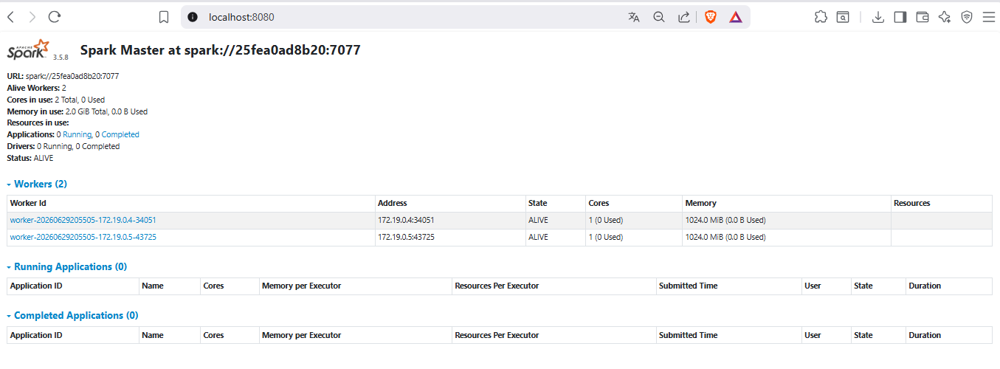
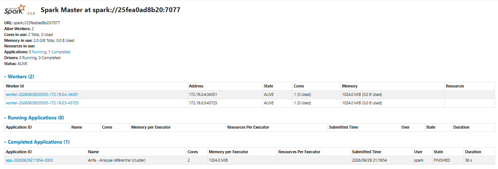
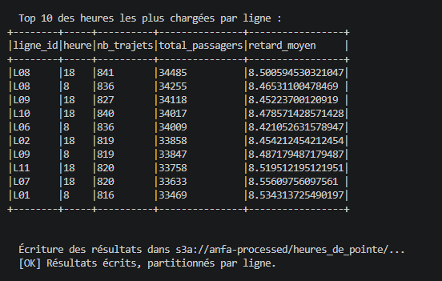
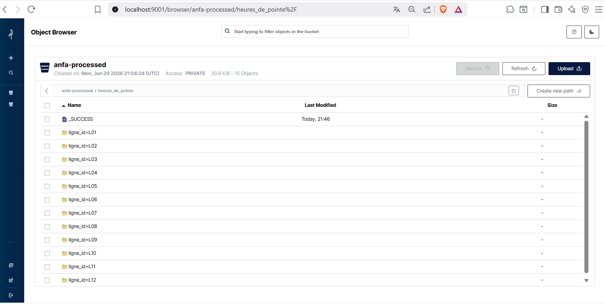

I. Rendu Séance 5

Nom et prénom : AGBOTA Adjo Anne Bienvenue Sika

II. Résumé de la séance

Déploiement d'un cluster Spark standalone (1 master + 2 workers) via Docker Compose, soumission de deux jobs PySpark distribués lisant le référentiel Anfa depuis MinIO via le connecteur S3A, calcul de statistiques et d'heures de pointe, écriture des résultats en Parquet dans la zone anfa-processed de MinIO. Comparaison entre le mode local (séance 2) et le mode cluster. Déploiement bonus de Spark sur Kubernetes via Kind et le Spark Operator.

III.  Étapes principales

1. Déploiement du cluster Spark standalone (1 master + 2 workers) via Docker Compose.

2. Préparation de MinIO : création des buckets anfa-raw et anfa-processed, upload &#x20; du référentiel (4 CSV).

3. Premier job distribué (`analyse\_referentiel\_cluster.py`) : statistiques de base &#x20; (12 lignes, 60 arrêts, 93 bus actifs, 4538 places). Résultats écrits en Parquet &#x20;  dans anfa-processed.

4. Génération d'un historique simulé de 79 368 trajets sur 30 jours via &#x20;  `generer\_trajets.py`, stocké dans anfa-raw/trajets/.

5. Job d'analyse des heures de pointe (`heures\_de\_pointe.py`) : agrégation par ligne &#x20;  et par heure (groupBy = shuffle), écriture en Parquet partitionné par ligne\_id &#x20;  dans anfa-processed/heures\_de\_pointe/.

6. Comparaison subjective entre mode local et mode cluster.

7. Déploiement bonus de Spark sur Kubernetes : création d'un cluster Kind, installation &#x20;  du Spark Operator via Helm, soumission d'un SparkApplication via manifeste YAML, &#x20;  exécution réussie du job pi.py avec 2 executors (Pi ≈ 3.137640).

8. Arrêt propre de la stack : suppression du job Kubernetes, du cluster Kind, &#x20;  et arrêt du Docker Compose.

IV. Captures d'écran

1. Dashboard Spark Master avec 2 workers

2. Applications Spark exécutées avec succès

3. Résultats du Top 10 dans la console

4. Bucket anfa-processed avec heures\_de\_pointe partitionné

V. Réflexion : local vs cluster

1. Temps d'exécution observé

En mode local (séance 2), les scripts PySpark s'exécutaient en quelques secondes sur les petits CSV du référentiel. En mode cluster (séance 5), chaque job a pris environ 32 à 36 secondes pour le job référentiel, et un temps similaire pour le job heures de pointe sur 79 368 trajets. Le mode cluster est donc perceptiblement plus lent sur ces volumes, ce qui est cohérent avec ce qu'explique le cours : l'overhead de communication entre le Driver et les Executors, le téléchargement des packages Maven au premier lancement, et la coordination entre les 2 workers coûtent plus cher que ce que le parallélisme rapporte sur un si petit dataset.

2. Différences perçues entre les deux approches
Le mode cluster introduit une complexité supplémentaire à plusieurs niveaux :

    - La commande `spark-submit` remplace le simple `python3 script.py` : il faut &#x20; préciser le master, les packages, le cache Ivy.

    - La configuration S3A dans la SparkSession est plus verbeuse qu'un simple &#x20; chemin local : endpoint, clés, path-style access, implémentation S3AFileSystem.

    - L'UI Spark Master (http://localhost:8080) offre en contrepartie une visibilité &#x20; totale sur l'exécution : workers, applications, stages, tâches en temps réel.

    - Le deuxième lancement du job a été nettement plus rapide au démarrage car les &#x20; packages Maven étaient déjà en cache (0 artifacts downloaded), ce qui montre &#x20; l'importance du cache dans un workflow répété.

    - Sur Kubernetes, la complexité est encore plus grande (Kind, Helm, Spark Operator, &#x20; manifeste YAML SparkApplication), mais le job s'exécute de façon identique une &#x20; fois le cluster prêt.

3. Quel mode utiliser pour quelle situation ?

    - Mode local : pour le développement, les tests, le débogage, et l'analyse de petits datasets (moins de 100 000 lignes). C'est le mode le plus simple, le plus rapide à mettre en place, et le plus efficace quand les données tiennent en RAM.

    - Mode cluster standalone (Docker Compose) : pour un environnement de pré-production ou de formation, quand on veut tester le comportement distribué sans infrastructure cloud. C'est ce qu'on a fait dans ce TP : idéal pour comprendre les mécanismes sans coût.

    - Mode cluster Kubernetes : pour la production réelle. On réutilise l'infrastructure Kubernetes existante, on bénéficie de l'élasticité, de l'isolation et de l'outillage de monitoring unifié. C'est la trajectoire recommandée pour Anfa dès que les volumes augmentent significativement.

    - Règle pratique : si Anfa doit analyser les 4 CSV du référentiel (quelques centaines de lignes), le mode local est largement suffisant. Si Anfa doit traiter 5 millions de trajets par mois chaque nuit en production, le cluster Kubernetes (ou un service managé comme Databricks ou EMR) devient indispensable : les données dépassent la RAM d'une seule machine, la tolérance aux pannes est requise, et le parallélisme sur plusieurs executors apporte un gain réel.

VI. Bonus Spark sur Kubernetes

Réalisé : oui.

Démarche :

1. Recréation du cluster Kind (`kind create cluster --name anfa`).

2. Création du namespace spark (`kubectl create namespace spark`).

3. Installation de Helm via Chocolatey.

4. Ajout du dépôt Spark Operator et installation via Helm dans le namespace spark.

5. Attente que les pods `spark-operator-controller` et `spark-operator-webhook` &#x20;  passent à l'état Running (téléchargement de l'image ghcr.io \~16 minutes).

6. Création d'un manifeste `spark-k8s-job.yaml` (SparkApplication) soumettant &#x20;  le job pi.py fourni avec Spark.

7. Application du manifeste (`kubectl apply -f spark-k8s-job.yaml`).

8. Observation du cycle complet : Driver en ContainerCreating → Running, puis &#x20;  2 Executors en Running → Completed, puis Driver Completed.

9. Vérification des logs : `Pi is roughly 3.137640`, exitCode 0.

10. Nettoyage : suppression du SparkApplication, du cluster Kind, arrêt du &#x20;   Docker Compose.

Résultat : le même job Spark tourne sur Kubernetes exactement comme sur le cluster standalone, avec le même code et la même image Docker. Seule la couche d'orchestration change, ce qui confirme la portabilité de PySpark.

VII. Difficultés rencontrées

    - Helm n'était pas installé : installation via Chocolatey en mode Administrateur &#x20;.

    - Le téléchargement des images du Spark Operator (ghcr.io) a pris environ 16 &#x20; minutes sur le cluster Kind : patience requise, le `-w` de kubectl permet de &#x20; surveiller sans relancer manuellement.

    - Le premier lancement de spark-submit a nécessité le téléchargement des packages &#x20; Maven hadoop-aws et aws-java-sdk-bundle (\~275 Mo) : les lancements suivants ont &#x20; bénéficié du cache et ont démarré beaucoup plus vite.

