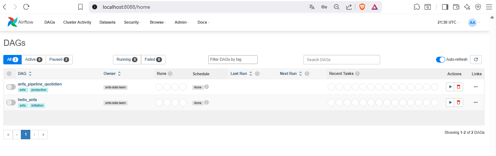
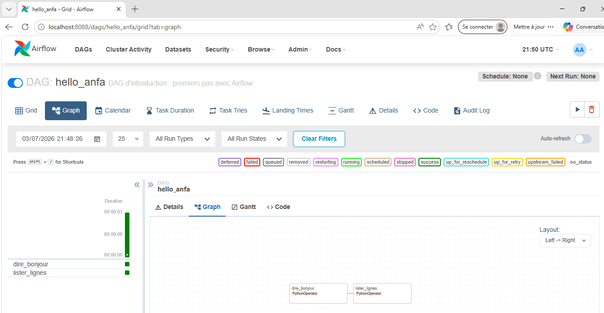
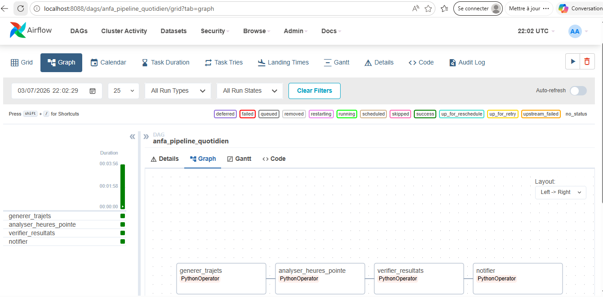
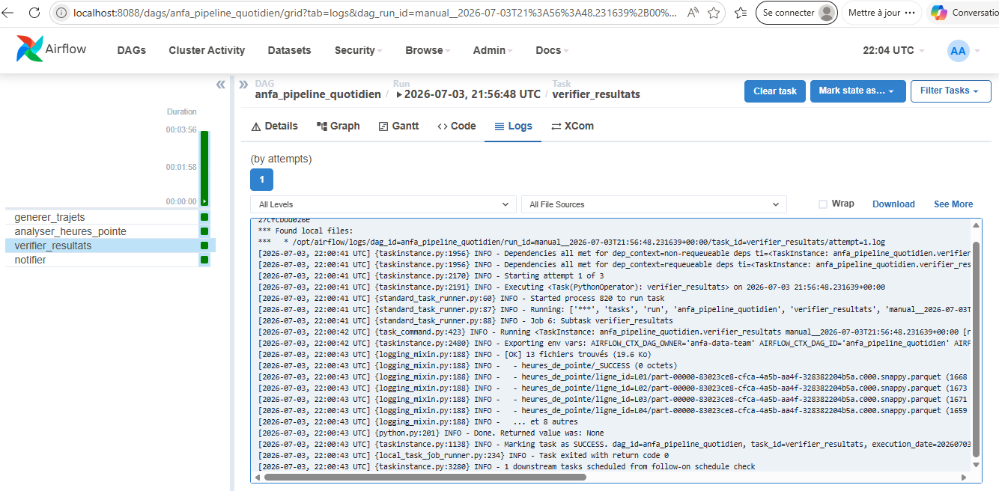
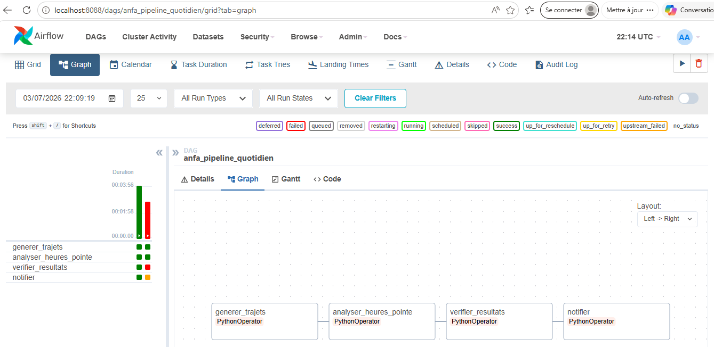

I- Rendu Séance 6

Nom et prénom : AGBOTA Adjo Anne

Identifiant GitHub : Bienvenue-code 

Date de soumission : 03/07/2026

II- Résumé de la séance

Déploiement d'Apache Airflow localement via Docker Compose dans une stack complète incluant PostgreSQL, MinIO et un cluster Spark (1 master + 1 worker). Écriture et exécution d'un premier DAG d'initiation (hello_anfa) à 2 tâches, puis d'un DAG métier complet (anfa_pipeline_quotidien) à 4 tâches orchestrant le pipeline Anfa :
1. génération de trajets simulés, 
2. analyse Spark des heures de pointe, 
3. vérification des résultats dans MinIO, et 
4. notification. 

Observation des retries automatiques d'Airflow en cassant volontairement une tâche, puis réparation et rejeu depuis l'UI.

III- Étapes principales

1. Synchronisation du fork avec le dépôt du cours (récupération de seance-06/).
2. Correction du docker-compose.yml (postgres:18-alpine → postgres:15-alpine) pour résoudre une incompatibilité de version.
3. Déploiement de la stack complète : PostgreSQL, Airflow (init + scheduler + webserver), MinIO, Spark Master + Worker.
4. Initialisation de MinIO : création des buckets anfa-raw et anfa-processed, configuration de la clé applicative anfa-app-key.
5. Exécution du DAG hello_anfa : 2 tâches (dire_bonjour, lister_lignes) en succès, logs inspectés.
6. Exécution du DAG anfa_pipeline_quotidien : 4 tâches enchaînées en succès (generer_trajets → analyser_heures_pointe → verifier_resultats → notifier). Le job Spark a été soumis au cluster depuis Airflow via le SDK Docker.
7. Démonstration des retries : modification volontaire de verifier_resultats pour lever une ValueError, observation des 3 tentatives (1 + 2 retries),tâche rouge et notifier en upstream_failed.
8. Réparation : remise du code original, Clear de la tâche en échec, reprise automatique du pipeline à partir de verifier_resultats sans rejouer les tâches précédentes.
9. Arrêt propre de la stack (docker compose down).

IV- Captures d'écran

1. Page d'accueil Airflow avec les 2 DAGs

2. Graph view du DAG hello_anfa après succès

3. Graph view du DAG métier complet en succès

4. Logs de la tâche verifier_resultats

5. Tâche en échec et upstream_failed

V- Réflexion personnelle

1. Qu'est-ce qu'Airflow apporte par rapport à cron ?

Je n'avais jamais utilisé cron avant ce TP. La découverte d'Airflow m'a permis de visualiser de façon concrète comment un orchestrateur gère les erreurs : quand verifier_resultats a échoué, Airflow a retenté automatiquement, puis a bloqué uniquement les tâches dépendantes sans toucher aux précédentes. Après correction du bug, un simple Clear a suffi pour reprendre le pipeline exactement là où il s'était arrêté, sans rejouer generer_trajets ni analyser_heures_pointe. C'est ce qui m'a le plus marqué : corriger une erreur sans reprendre toute l'exécution depuis le début.

2. Ce qui m'a le plus marqué

L'ensemble du TP a été révélateur. Voir les 4 tâches s'enchaîner dans la Graph view, observer les couleurs évoluer en temps réel, inspecter les logs de chaque tâche individuellement — tout cela rend l'orchestration très concrète et intuitive, bien loin d'un simple script lancé à la main.

3. Complexité perçue

Airflow m'a semblé moins complexe à déployer que Spark en séance 5. Moins de commandes à taper, une UI très lisible, et les DAGs sont de simples fichiers Python déposés dans un dossier. La seule difficulté rencontrée a été l'incompatibilité de version de PostgreSQL, résolue rapidement.

4. Usage futur

J'utiliserais Airflow dans tout projet data nécessitant des traitements récurrents et automatisés : par exemple, déclencher chaque nuit l'analyse des trajets Anfa, envoyer une alerte en cas d'échec, et rejouer automatiquement les calculs si un bug est détecté sur une période passée.

VI- Qu'est-ce qu'Airflow apporte par rapport à cron ?

Cron sait uniquement lancer une commande à heure fixe. Airflow apporte tout ce qui manque pour industrialiser un pipeline data :
    - Les dépendances entre tâches : analyser_heures_pointe n'a démarré que parce que generer_trajets avait réussi.
    - Les retries automatiques : Airflow a retenté verifier_resultats 2 fois avant de déclarer l'échec, sans intervention manuelle.
    - La visibilité : la Graph view permet de voir en un coup d'œil l'état de chaque tâche, en temps réel.
    - Le rejeu ciblé : après correction du bug, on a pu relancer uniquement à partir de la tâche en échec, sans rejouer generer_trajets ni analyser_heures_pointe.
Avec cron, il aurait fallu tout relancer depuis le début.

VII- Ce qui m'a le plus marqué

La démonstration des retries a été particulièrement parlante : voir Airflow réessayer automatiquement, attendre entre chaque tentative, puis marquer la tâche suivante en upstream_failed sans l'exécuter, illustre concrètement pourquoi un orchestrateur est indispensable en production. La réparation par Clear est aussi très élégante : on ne rejoue que ce qui a échoué.

VIII- Architecture retenue et pourquoi

Le job Spark ne tourne pas dans Airflow (l'image Airflow n'a pas de Java). Airflow pilote le conteneur Spark Master via le SDK Docker (socket Docker monté dans le compose), et spark-submit s'exécute là où Java est disponible. En production, on utiliserait le SparkSubmitOperator officiel avec une image Airflow contenant un JDK.

IX- Difficultés rencontrées

1. L'image postgres:18-alpine fournie dans le docker-compose.yml est incompatible avec le format de stockage attendu par le volume Docker existant. Solution : remplacer par postgres:15-alpine et supprimer les volumes (docker compose down -v)
  avant de relancer.
2. Le DAG n'apparaît pas immédiatement dans l'UI : le scheduler scanne le dossier dags/ toutes les 30 secondes, il faut patienter ou rafraîchir manuellement.