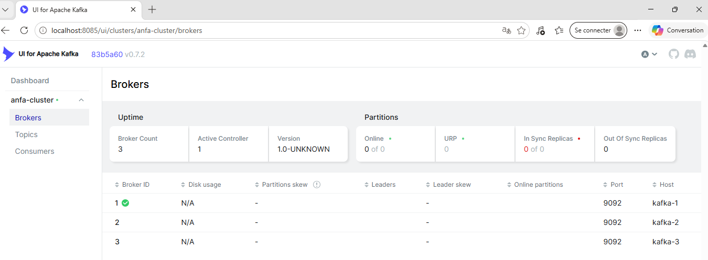
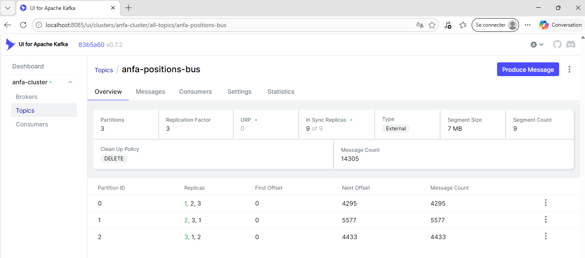
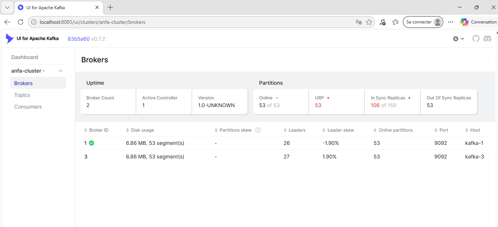
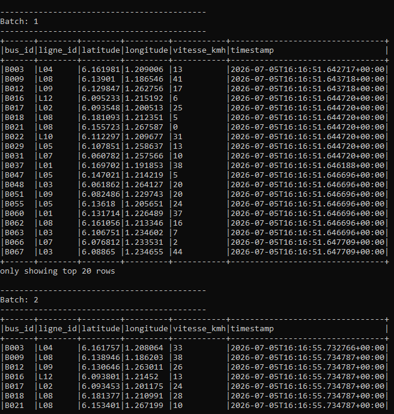
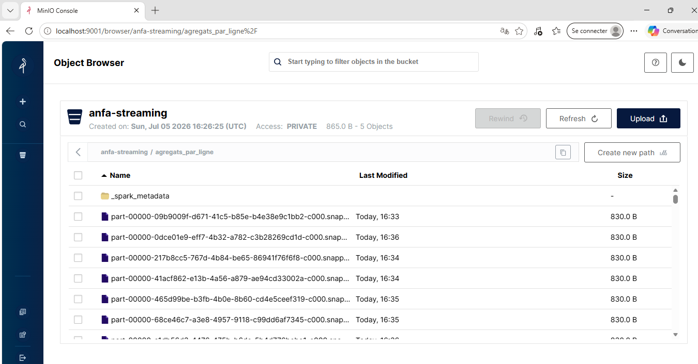

# Rendu — Séance 7

**Nom et prénom :** AGBOTA Adjo Anne

**Identifiant GitHub :** Bienvenue-code

**Date de soumission :** <05/07/2026>

## Résumé de la séance : 
<3-5 : cluster Kafka 3 brokers déployé, flotte de bus simulée en flux continu, tolérance aux pannes observée, Spark Structured Streaming consommant et agrégeant le flux vers MinIO.>

Cette séance introduit Apache Kafka, un système de messagerie distribué conçu pour absorber des flux de données à haut débit et les rendre disponibles à plusieurs consommateurs indépendants, contrairement aux pipelines batch vus jusqu'ici (Airflow + Spark en séances 5-6) qui traitent des données déjà accumulées à intervalle régulier. Depuis la version 4.x, Kafka fonctionne en mode KRaft (Kafka Raft), qui supprime la dépendance historique à Zookeeper : les nœuds Kafka eux-mêmes assurent la coordination du cluster via un algorithme de consensus distribué. Chaque nœud peut cumuler deux rôles, broker (stockage et service des données) et controller (élection et coordination), une configuration réaliste pour un petit cluster.

L'organisation interne d'un topic Kafka repose sur deux notions complémentaires. Le partitionnement découpe un topic en plusieurs partitions indépendantes, ce qui permet de répartir la charge d'écriture et de lecture entre plusieurs brokers ; l'affectation d'un message à une partition dépend de sa clé, garantissant que tous les messages portant la même clé arrivent toujours dans la même partition et donc dans un ordre strictement préservé. La réplication, elle, duplique chaque partition sur plusieurs brokers (ici 3), avec un paramètre de quorum minimal (min.insync.replicas) déterminant combien de copies synchronisées sont exigées avant qu'une écriture soit confirmée. C'est la combinaison de ces deux mécanismes qui permet à un cluster de survivre à la perte d'un ou plusieurs brokers sans interruption de service ni perte de données : les partitions dont le broker disparu était leader basculent automatiquement leur leadership vers une réplique synchronisée existante.

Côté consommation, Kafka introduit la notion de group_id : chaque groupe de consommateurs maintient sa propre position de lecture (offset) sur chaque partition, indépendamment des autres groupes et indépendamment de la rétention des messages eux-mêmes (qui restent physiquement stockés selon la politique de rétention du topic, qu'ils aient été lus ou non). Cela permet à plusieurs applications de consommer le même flux en parallèle, chacune à son propre rythme, et de rejouer un flux depuis le début simplement en changeant de group_id ou en repositionnant les offsets.

Enfin, Spark Structured Streaming permet de traiter ce flux continu avec la même API que le traitement batch (DataFrame), la seule différence syntaxique étant l'usage de readStream au lieu de read. L'agrégation en fenêtres temporelles glissantes (ici 30 secondes) permet de calculer des métriques périodiques sur le flux ; le mécanisme de watermark fixe une tolérance de retard au-delà de laquelle une fenêtre est définitivement fermée, évitant que Spark ne conserve un état illimité en mémoire pour des messages hypothétiquement très en retard. Le checkpointing, quant à lui, joue un rôle analogue aux offsets Kafka côté consommateur classique : il permet à un job de reprendre exactement où il s'était arrêté en cas de redémarrage, sans perte ni duplication.

## Étapes principales

1. Déploiement du cluster Kafka (3 brokers, mode KRaft) + Kafka UI.
2. Création du topic `anfa-positions-bus` (3 partitions, réplication 3).
3. Premier producer/consumer Python pour comprendre la mécanique.
4. Simulation de 100 bus envoyant leur position en continu.
5. Démonstration de tolérance aux pannes (arrêt d'un broker).
6. Spark Structured Streaming : lecture console, puis agrégation en fenêtre vers MinIO.

## Captures d'écran

### 3 brokers actifs dans Kafka UI

### Débit de messages en augmentation

### Cluster avec 2 brokers sur 3 (après arrêt volontaire)

### Micro-batchs affichés en console par Spark

### Résultats agrégés dans MinIO

## Réflexion personnelle

<3-5 lignes : dans quel cas utiliseriez-vous Kafka + Spark Streaming plutôt que le pipeline batch
Airflow + Spark vu en séance 5-6 ? 

Le choix entre Kafka + Spark Streaming et le pipeline batch Airflow + Spark dépend essentiellement de la contrainte de fraîcheur des données. Le pipeline batch est adapté à des traitements périodiques où un délai de quelques heures (ou une exécution quotidienne) est acceptable, par exemple pour un rapport de synthèse consolidé une fois par jour ; il est plus simple à opérer et suffisant tant que la donnée n'a pas besoin d'être exploitée immédiatement. À l'inverse, le couple Kafka + Spark Streaming devient nécessaire dès qu'une décision ou un affichage doit refléter l'état du système en quasi temps réel, comme le suivi en direct d'une flotte de bus : ici, la valeur de l'information dépend justement du fait qu'elle soit disponible à la seconde près plutôt que dans un rapport de la veille.

Qu'est-ce que la réplication à 3 brokers vous a concrètement montré ?>

La démonstration de tolérance aux pannes a été la partie la plus parlante de cette séance. Voir concrètement le simulateur continuer d'envoyer ses messages sans la moindre erreur pendant que l'un des trois brokers était arrêté, puis constater dans Kafka UI que les partitions concernées avaient basculé leur leadership vers un autre broker, a rendu très concret un principe qui restait abstrait en théorie. Cela montre que la réplication à 3 n'est pas qu'une case à cocher dans la configuration, mais bien la condition qui rend possible la continuité de service : sans elle, la perte d'un seul broker aurait interrompu tout le pipeline en aval.

## Réponses aux exercices d'application

Cette séance ne comportait pas d'exercices d'application numérotés à proprement parler ; le TP était structuré autour de points de vérification progressifs (0 à 6) validant chaque étape du pipeline. La section "Pour aller plus loin" propose des pistes optionnelles hors évaluation (plusieurs consumer groups en parallèle, rejeu depuis l'historique via startingOffsets="earliest", ajout d'une vue CQRS avec outputMode("update"), Kafka Connect en remplacement partiel du job Spark) qui n'ont pas été explorées dans le cadre de ce rendu mais dont la compréhension théorique a été abordée dans le résumé de séance ci-dessus.

## Difficultés rencontrées

Deux difficultés mineures ont été rencontrées, toutes deux résolues sans bloquer la progression du TP :

1. L'installation de `kafka-python` via pip a d'abord échoué avec une erreur Windows (`OSError: [WinError 2]`) lors de l'écriture d'un exécutable annexe dans le dossier Scripts de Python. Un second essai de la même commande a suffi, le module s'étant en réalité déjà installé correctement malgré l'erreur affichée.

2. Lors du lancement du job d'agrégation Spark (Partie 6.2), le job précédent (lecture console) n'avait pas été totalement arrêté malgré le Ctrl+C dans le terminal : celui-ci ferme la session PowerShell locale mais ne transmet pas toujours le signal d'interruption jusqu'au driver Spark exécuté à l'intérieur du conteneur via docker exec. Cela a temporairement bloqué le job d'agrégation en attente de ressources (un seul cœur disponible sur le worker). Le problème a été diagnostiqué via l'interface Spark Master (http://localhost:8091), qui affichait les deux applications actives, puis résolu en tuant manuellement l'application zombie depuis cette interface.
