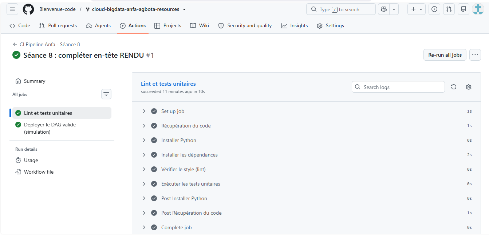
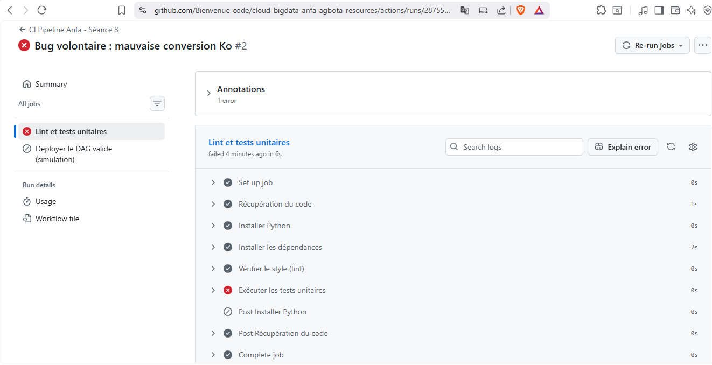

# Rendu — Séance 8

**Nom et prénom :** AGBOTA Adjo Anne

**Identifiant GitHub :** Bienvenue-code

**Date de soumission :** 05/07/2026

## Résumé de la séance

<2-4 lignes : logique métier séparée et testée, pipeline CI/CD GitHub Actions
écrit, démonstration d'un test bloquant le déploiement.>

Cette séance introduit le DataOps, l'application au traitement des données des disciplines que le DevOps a établies pour le développement logiciel : automatiser les tests et les déploiements plutôt que de les effectuer manuellement. Le déploiement manuel pratiqué depuis la séance 1 (docker compose up, kubectl apply, copie d'un fichier DAG) fonctionne tant qu'on est seul sur sa propre machine, mais devient dangereux dès qu'une équipe travaille ensemble sur un vrai serveur de production : absence de relecture avant mise en production, absence de tests automatiques, absence de traçabilité de qui a déployé quoi, et aucune garantie que ce qui fonctionne localement fonctionne ailleurs. Le DataOps ajoute une dimension supplémentaire par rapport au DevOps classique : les pipelines manipulent des données et pas seulement du code, et un bug peut corrompre silencieusement des résultats pendant plusieurs jours avant d'être détecté, en particulier lorsque le pipeline est planifié plutôt que déclenché par un utilisateur qui remarquerait immédiatement une erreur.

Trois familles de tests s'appliquent à un pipeline data. Les tests unitaires vérifient qu'une fonction fait ce qu'elle est censée faire, indépendamment des données réelles. Les tests de données vérifient que les données produites respectent des règles attendues (absence de valeurs nulles, contraintes de cohérence, absence de doublons). Les contrats de données formalisent l'accord entre deux équipes sur le format des données échangées, de sorte que l'équipe consommatrice puisse compter sur une structure stable sans la revérifier à chaque fois. Pour rendre une logique métier testable sans dépendre d'Airflow (lourd à installer et lent à exécuter en CI), on extrait cette logique dans un module Python pur, sans appel réseau ni objet Airflow, que le DAG importe ensuite comme une simple fonction.

Un pipeline CI/CD s'organise en étapes séquentielles où chaque étape bloque la suivante en cas d'échec : lint (vérification du style), tests (unitaires et de données), build (construction d'une image si nécessaire), publish (publication de l'artefact), déploiement (livraison effective). L'intégration continue (CI) répond à la question « mon changement casse-t-il quelque chose ? » et se déclenche à chaque push ou pull request ; le déploiement continu (CD) répond à « mon changement peut-il aller en production ? » et peut être entièrement automatique (Continuous Deployment) ou nécessiter une validation humaine explicite avant le déclenchement final (Continuous Delivery), l'option retenue pour ce TP. GitHub Actions, la plateforme CI/CD intégrée à GitHub, exécute des workflows définis en YAML : un workflow est déclenché par un événement (push, pull request), organisé en jobs (ensembles d'étapes exécutés sur une machine virtuelle appelée runner), eux-mêmes composés de steps utilisant des actions réutilisables comme actions/checkout.

Enfin, le GitOps fait de Git la source unique de vérité pour l'état souhaité de l'infrastructure et des pipelines : aucun changement n'est appliqué manuellement, tout passe par un commit, une revue en Pull Request, et un merge qui déclenche automatiquement le déploiement. Cela apporte une traçabilité complète (chaque changement est un commit daté et attribué), une réversibilité immédiate (git revert), et surtout une revue systématique qui empêche qu'un code non validé n'atteigne la production sans qu'un collègue ne l'ait examiné.

## Étapes principales

1. Séparation de la logique métier (`anfa_logic.py`) du DAG Airflow.
2. Écriture de 5 tests unitaires avec pytest.
3. Écriture du workflow GitHub Actions (lint + tests + déploiement simulé).
4. Démonstration : un bug volontaire bloque le déploiement ; correction et succès.

## Captures d'écran

### Workflow réussi (2 jobs)

### Job en échec, déploiement non exécuté

## Réflexion personnelle

<3-5 lignes : en quoi ce pipeline aurait-il empêché l'incident de Mawuli
(situation-problème du CM) ? Qu'est-ce que `needs:` change concrètement ?>

Ce pipeline aurait directement empêché l'incident de Mawuli. Dans la situation-problème du CM, le bug de syntaxe qu'il n'avait pas repéré localement (une variable d'environnement absente en production) n'a été découvert que deux heures plus tard, en pleine nuit, quand le pipeline a échoué sans que personne ne le sache avant le lendemain. Avec un pipeline CI/CD comme celui construit dans ce TP, son changement aurait d'abord été soumis à l'étape de lint et de tests automatiques dès le push ; si son erreur avait été détectée par un test (comme cela a été observé avec le bug volontaire de conversion Ko dans ce TP), le job de déploiement n'aurait tout simplement pas pu s'exécuter, grâce à la dépendance needs: valider-dag. Aucune chance que son code cassé n'atteigne la production avant qu'un collègue n'ait relu la Pull Request et corrigé l'erreur.

Concrètement, needs: crée une dépendance stricte entre jobs : le second job (deployer) ne démarre que si le premier (valider-dag) se termine avec succès. On l'a observé très clairement lors du test du bug volontaire, où le job de déploiement n'est même pas apparu comme exécuté après l'échec du job de validation. Cela transforme la CI d'un simple indicateur visuel (une case rouge ou verte qu'on pourrait ignorer) en un véritable verrou technique qui rend physiquement impossible le déploiement d'un changement non validé, ce qui est bien plus robuste qu'une simple convention d'équipe demandant de ne pas déployer si les tests échouent.

## Difficultés rencontrées

L'installation des dépendances (`pytest`, `flake8`) via pip a rencontré à plusieurs reprises la même erreur Windows déjà observée en séance 7 (`OSError: [WinError 2]` lors de l'écriture d'un exécutable dans le dossier Scripts de Python, probablement liée à un scan antivirus temporaire). Contrairement à la séance 7, l'erreur a nécessité plusieurs tentatives successives avant que tous les modules soient effectivement installés malgré les messages d'erreur affichés. La solution retenue a été de vérifier systématiquement la disponibilité réelle des modules via `python -c "import ..."`, puis d'utiliser la syntaxe `python -m pytest` et `python -m flake8` plutôt que les commandes directes `pytest`/`flake8`, ce qui contourne complètement le problème d'écriture des exécutables `.exe`.

Un second point a nécessité un ajustement : le premier `git push` de la branche `seance-08` n'a déclenché aucun workflow, car aucun nouveau commit n'accompagnait la création de la branche (le contenu provenait déjà d'un merge upstream antérieur). Le filtre `paths` de GitHub Actions compare les fichiers modifiés entre deux commits ; sans nouveau commit touchant `seance-08/`, aucun changement n'était détecté. Une modification réelle du fichier RENDU.md (complétion de l'en-tête) a permis de déclencher le workflow correctement lors du commit suivant.
