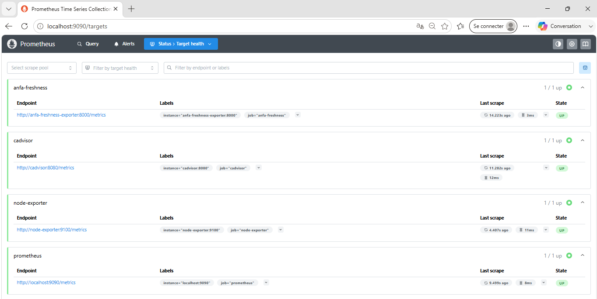
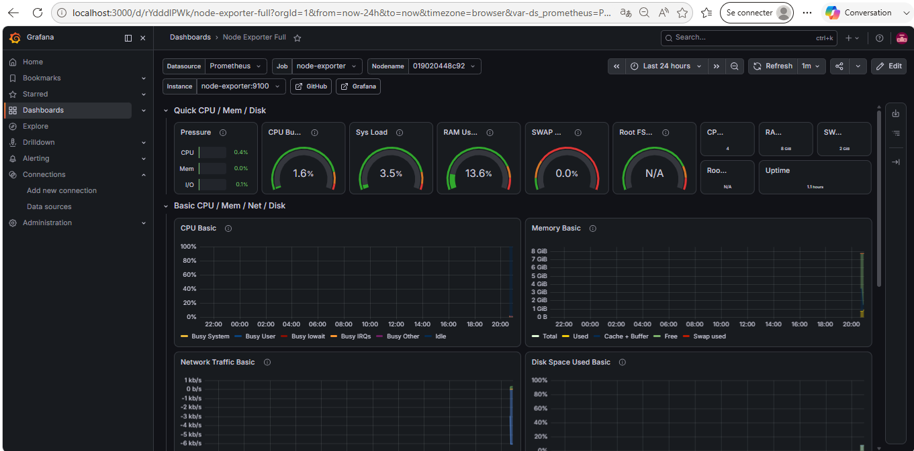
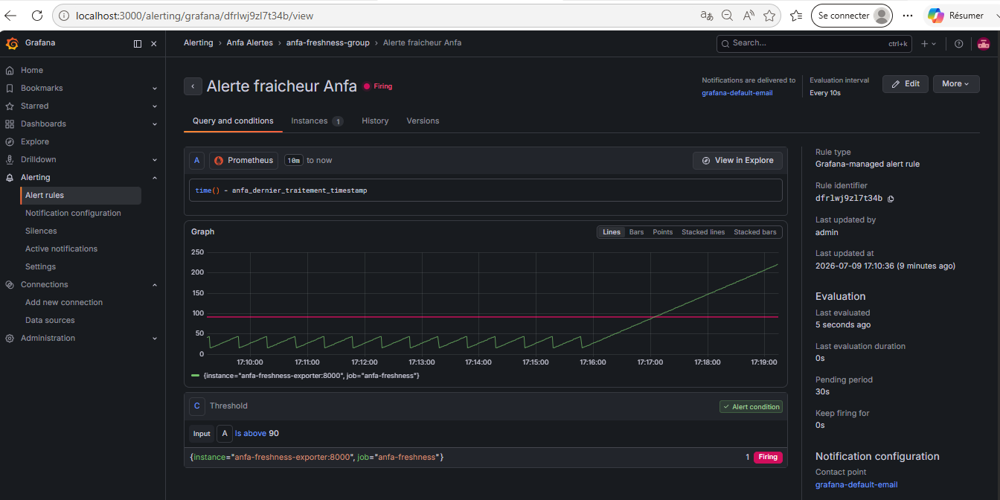

# Rendu — Séance 9

**Nom et prénom :** AGBOTA Adjo Anne Bienvenue Sika
**Identifiant GitHub :** Bienvenue-code
**Date de soumission :** 09/07/2026

## Résumé de la séance

Cette séance porte sur le monitoring et l'observabilité, avec Prometheus (collecte et
stockage de métriques via un modèle **pull**, en scrapant des **exporters**) et Grafana
(visualisation et alerting à partir de ces métriques). On distingue le **monitoring**
(surveiller des indicateurs connus à l'avance) de l'**observabilité** (diagnostiquer des
problèmes imprévus) — le monitoring étant un sous-ensemble de l'observabilité. Pour un
pipeline data, quatre familles de métriques comptent : latence, débit, taux d'erreurs, et
surtout la **fraîcheur des données**, souvent négligée alors qu'elle seule peut révéler
qu'un pipeline "tourne" tout en étant silencieusement inutile. Les concepts de **SLI/SLO/SLA**
permettent de définir à l'avance ce qui est acceptable, pour éviter la fatigue d'alerte.
Concrètement, j'ai déployé une stack Prometheus + Grafana + Node Exporter + cAdvisor +
un exportateur métier custom, construit un dashboard avec une jauge de fraîcheur à seuils,
configuré une alerte Grafana sur cette métrique, puis simulé une panne silencieuse et
observé le déclenchement (Firing) et la résolution automatique de l'alerte.

## Étapes principales

1. Déploiement de Prometheus, Node Exporter, cAdvisor, Grafana et d'un exportateur
   métier custom (fraîcheur des données Anfa).
2. Exploration des cibles Prometheus et premières requêtes PromQL.
3. Import du dashboard "Node Exporter Full" et construction d'un panneau custom.
4. Configuration d'une alerte Grafana sur la fraîcheur des données.
5. Simulation d'une panne silencieuse et observation du déclenchement de l'alerte.

## Captures d'écran

### Les 4 cibles Prometheus à l'état UP

### Dashboard "Node Exporter Full" importé

### Alerte à l'état Firing après panne simulée

## Réflexion personnelle

Cette séance illustre très concrètement la situation-problème d'Awa : le CM montrait
qu'un pipeline peut avoir un statut "Running" sur Kubernetes, un DAG Airflow en
"success", et pourtant traiter des données vides ou obsolètes sans qu'aucune alerte ne
se déclenche. En Partie 5, j'ai reproduit exactement ce scénario : en créant le fichier
sentinelle, l'exportateur reste vivant (`docker compose ps` montre tout `Up`), aucun
log d'erreur n'apparaît ailleurs, le conteneur ne plante jamais — pourtant la métrique
de fraîcheur grimpe en continu et finit par déclencher l'alerte. Ni le CPU, ni la RAM,
ni le statut des conteneurs n'auraient permis de détecter ce problème : ces métriques
restent parfaitement normales pendant toute la panne simulée. Seule une métrique métier
custom, pensée spécifiquement pour surveiller "depuis combien de temps le pipeline n'a-t-il
pas produit de résultat valide", peut révéler ce type de panne silencieuse. Je comprends
maintenant pourquoi le CM insiste autant sur la fraîcheur des données comme "piège
invisible" : c'est la seule des quatre métriques (latence, débit, erreurs, fraîcheur) qui
ne dépend d'aucune erreur technique visible.

## Difficultés rencontrées

Ma principale difficulté a été de trouver où configurer l'alerte : contrairement à ce
que décrivait l'énoncé du TP, il n'y avait pas d'onglet "Alert" directement accessible
depuis l'éditeur du panneau de fraîcheur (seulement "Queries" et "Transformations"),
probablement en raison de la version de Grafana installée (13.1.0-slim). J'ai dû passer
par le menu dédié Alerting → Alert rules → New alert rule pour créer la règle
manuellement, en reconstruisant la même requête PromQL. De même, le contact point
`grafana-default-email` n'existait pas par défaut : j'ai dû le créer moi-même depuis
Alerting → Contact points avant de pouvoir le sélectionner dans ma règle d'alerte.
Enfin, mon ordinateur s'est éteint accidentellement en cours de TP juste avant la
Partie 4 ; heureusement, les conteneurs et le dashboard déjà créé ont survécu au
redémarrage de Docker Desktop (le volume Grafana a persisté), je n'ai donc perdu
aucun travail, seulement quelques minutes de données Prometheus récentes.